# Data Science for the Linear Algebraist. 
 
## Project Overview
A not-so comprehensive guide bridging linear algebra theory with practical data science implementation. Meant for someone to learn data science by using their strong linear algebra background. 
This project demonstrates how fundamental linear algebra concepts power modern machine learning algorithms, with hands-on Python implementations.

## Main Dependencies
- **Python 3**
- **NumPy** - Matrix operations and linear algebra
- **Pandas** - Data manipulation
- **Matplotlib** - Visualization

## Key Demonstrations
1. **Least Squares Regression** - From theory to implementation
2. **QR Decomposition and SVD** - Numerical stability in solving systems
3. **PCA** - Dimensionality reduction
4. **Project** - Applying low-rank approximation (via truncated SVD) to an image of my beautiful dog

## To do
- [ ] Upload Jupyter notebook

## Contact
Pawel Sarkowicz

💼 <a href="https://www.linkedin.com/in/pawel-sarkowicz-668221390/">LinkedIn</a>

🌐 <a href="https://pawelsarkowicz.xyz">website</a>

💻 <a href="https://git.pawelsarkowicz.xyz/ps">git</a>

📧 <a href="mailto:ps@pawelsarkowicz.xyz">email</a>

January 2026

---

## Table of Contents

1.  [Introduction: The Basic Data Science Problem](#introduction)
2.  [Solving the Problem: Least Squares and Matrix Decompositions](#solving-the-problem-least-squares-regression-and-matrix-decompositions)
3.  [Principal Component Analysis](#principal-component-analysis)
4.  [Project: Spectral Image Denoising via Truncated SVD](#project-spectral-image-denoising-via-truncated-svd)
5.  [Appendix](#appendix)
6.  [Bibliography](#bibliography)

## Introduction

This is meant to be a not entirely comprehensive introduction to Data Science for the Linear Algebraist. There are of course many other complicated topics, but this is just to get the essence of data science (and the tools involved) from the perspective of someone with a strong linear algebra background.

One of the most fundamental questions of data science is the following. 

> **Question**: Given observed data, how can we predict certain targets?

The answer of course boils down to linear algebra, and we will begin by translating data science terms and concepts into linear algebraic ones. But first, as should be common practice for the linear algebraist, an example.

> **Example**. Suppose that we observe$1$`n=3`$ houses, and for each house we record
> - the square footage,
> - the number of bedrooms,
> - and additionally the sale price.
>   
>  So we have a table as follows.
>
> |House | Square ft | Bedrooms | Price (in $1000s) |
> | --- | --- | --- | --- |
> | 0 | 1600 | 3 | 500 |
> | 1 | 2100 | 4 | 650 |
> | 2 | 1550 | 2 | 475 |
>
> So, for example, the first house is 1600 square feet, has 3 bedrooms, and costs $500,000, and so on. Our goal will be to understand the cost of a house in terms of the number of bedrooms as well as the square footage.
> Concretely this gives us a matrix and a vector:
```math
X = \begin{bmatrix} 1600 & 3 \\ 2100 & 4 \\ 1550 & 2 \end{bmatrix} \text{ and } y =\begin{bmatrix} 500 \\ 650 \\ 475 \end{bmatrix}
```
> So translating to linear algebra, the goal is to understand how $y$ depends on the columns of $X$.


## Translation from Data Science to Linear Algebra

| Data Science (DS) Term | Linear Algebra (LA) Equivalent | Explanation |
| --- | --- | --- |
| Dataset (with (n) observations and (p) features) | A matrix$1$`X \in \mathbb{R}^{n \times p}`$ | The dataset is just a matrix. Each row is an observation (a vector of features). Each column is a feature (a vector of its values across all observations). |
| Features | Columns of $X$ | Each feature is a column in your data matrix. |
| Observation | Rows of $X$ | Each data point corresponds to a row. |
| Targets | A vector$1$`y \in \mathbb{R}^{n \times 1}`$ | The list of all target values is a column vector. |
| Model parameters | A vector$1$`\beta \in \mathbb{R}^{p \times 1}`$ | These are the unknown coefficients. |
| Model | Matrix–vector equation | The relationship becomes an equation involving matrices and vectors. |
| Prediction Error / Residuals | A residual vector$1$`e \in \mathbb{R}^{n \times 1}`$ | Difference between actual targets and predictions. |
| Training / "best fit" | Optimization: minimizing the norm of the residual vector | To find the "best" model by finding a model which makes the norm of the residual vector as small as possible. |

So our matrix $X$ will represent our data set, our vector $y$ is the target, and$1$`\beta`$ is our vector of parameters. We will often be interested in understanding data with "intercepts", i.e., when there is a base value given in our data. So we will augment a column of 1's (denoted by$1$`\mathbb 1`$) to $X$ and append a parameter$1$`\beta_0`$ to the top of$1$`\beta`$, yielding

```math
\tilde{X} = \begin{bmatrix} \mathbb{1} & X \end{bmatrix} \text{ and } \tilde{\beta} = \begin{bmatrix} \beta_0 \\ \beta_1 \\ \beta_2 \\ \vdots \\ \beta_p \end{bmatrix}.
```

So the answer to the Data Science problem becomes

> **Answer**: Solve, or best approximate a solution to, the matrix equation$1$`\tilde{X}\tilde{\beta} = y`$.

To be explicit, given$1$`\tilde{X}`$ and $y$, we want to find a$1$`\tilde{\beta}`$ that does a good job of roughly giving$1$`\tilde{X}\tilde{\beta} = y`$. There of course ways to solve (or approximate) such small systems by hand. However, one will often be dealing with enormous data sets with plenty to be desired. One view to take is that modern data science is applying numerical linear algebra techniques to imperfect information, all to get as good a solution as possible.

# Solving the problem: Least Squares Regression and Matrix Decompositions

If the system$1$`\tilde{X}\tilde{\beta} = y`$ is consistent, then we can find a solution. However, we are often dealing with overdetermined systems, in the sense that there are often more observations than features (i.e., more rows than columns in$1$`\tilde{X}`$, or more equations than unknowns), and therefore inconsistent systems. However, it is possible to find a **best fit** solution, in the sense that the difference

```math
e = y - \tilde{X}\tilde{\beta}
```

is small. By small, we often mean that $e$ is small in$1$`L^2`$ norm; i.e., we are minimizing the the sums of the squares of the differences between the components of $y$ and the components of$1$`\tilde{X}\tilde{\beta}`$. This is known as a **least squares solution**. Assuming that our data points live in the Euclidean plane, this precisely describes finding a line of best fit.

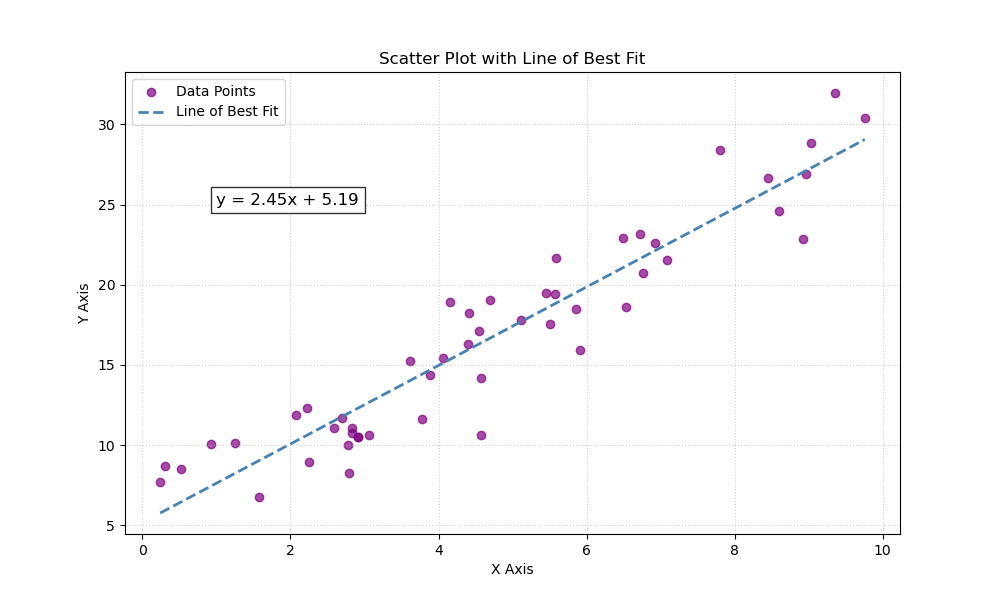

The structure of this sections is as follows.
- [Least Squares Solution](#least-squares-solution)
- [QR Decompositions](#qr-decompositions)
- [Singular Value Decomposition](#singular-value-decomposition)
- [A note on other norms](#a-note-on-other-norms)
- [A note on regularization](#a-note-on-regularization)
- [A note on solving multiple targets concurrently](#a-note-on-solving-multiple-targets-concurrently)
- [Polynomial regression](#polynomial-regression)
- [What can go wrong?](#what-can-go-wrong)

## Least Squares Solution

Recall that the Euclidean distance between two vectors$1$`x = (x_1,\dots,x_n) ,y = (y_1,\dots,y_n) \in \mathbb{R}^n`$ is given by

```math
||x - y||_2 = \sqrt{\sum_{i=1}^n |x_i - y_i|^2}.
```

We will often work with the square of the$1$`L^2`$ norm to simplify things (the square function is increasing, so minimizing the square of a non-negative function will also minimize the function itself).

> **Definition**: Let $A$ be an$1$`m \times n`$ matrix and$1$`b \in \mathbb{R}^n`$. A **least-squares solution** of$1$`Ax = b`$ is a vector$1$`x_0 \in \mathbb{R}^n`$ such that
> 
```math
\|b - Ax_0\|_2 \leq \|b - Ax\|_2 \text{ for all } x \in \mathbb{R}^n.
```

So a least-squares solution to the equation$1$`Ax = b`$ is trying to find a vector$1$`x_0 \in \mathbb{R}^n`$ which realizes the smallest distance between the vector $b$ and the column space
```math
\text{Col}(A) = \{Ax \mid x \in \mathbb{R}^n\}
```
of $A$. We know this to be the projection of the vector $b$ onto the column space. 

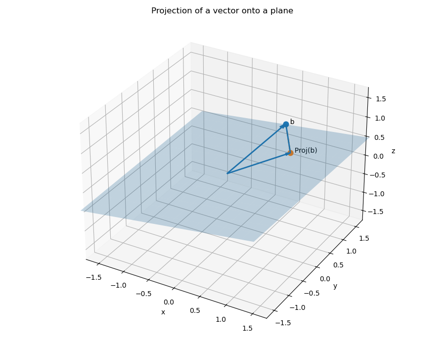

> **Theorem**: The set of least-squares solutions of$1$`Ax = b`$ coincides with solutions of the **normal equations**$1$`A^TAx = A^Tb`$. Moreover, the normal equations always have a solution.

Let us first see why we get a line of best fit. 

> **Example**. Let us show why this describes a line of best fit when we are working with one feature and one target. Suppose that we observe four data points
```math
X = \begin{bmatrix} 1 \\ 2 \\ 3 \\ 4 \end{bmatrix} \text{ and } y =  \begin{bmatrix} 1 \\ 2\\ 2 \\ 4 \end{bmatrix}.
```
> We want to fit a line$1$`y = \beta_0 + \beta_1x`$ to these data points. We will have our augmented matrix be
```math
\tilde{X} = \begin{bmatrix} 1 & 1 \\ 1 & 2 \\ 1 & 3 \\ 1 & 4 \end{bmatrix},
```
> and our parameter be
```math
\tilde{\beta} = \begin{bmatrix} \beta_0 \\ \beta_1 \end{bmatrix}.
```
> We have that
```math
\tilde{X}^T\tilde{X} = \begin{bmatrix} 4 & 10 \\ 10 & 30 \end{bmatrix} \text{ and } \tilde{X}^Ty = \begin{bmatrix} 9 \\ 27 \end{bmatrix}.
```
> The 2x2 matrix$1$`\tilde{X}^T\tilde{X}`$ is easy to invert, and so we get that
```math
\tilde{\beta} = (\tilde{X}^T\tilde{X})^{-1}\tilde{X}^Ty = \frac{1}{10}\begin{bmatrix} 15 & -5 \\ -5 & 2 \end{bmatrix}\begin{bmatrix} 9 \\ 27 \end{bmatrix} = \begin{bmatrix} 0 \\ \frac{9}{10} \end{bmatrix}.
```
> So our line of best fit is of them form$1$`y = \frac{9}{10}x`$.

Although the above system was small and we could solve the system of equations explicitly, this isn't always feasible. We will generally use python in order to solve large systems. 
- One can find a least-squares solution using `numpy.linalg.lstsq`.
- We can set up the normal equations and solve the system by using `numpy.linalg.solve`
Although the first approach simplifies things greatly, and is more or less what we are doing anyway, we will generally set up our problems as we would by hand, and then use `numpy.linalg.solve` to help us find a solution. However, computing$1$`X^TX`$ can cause lots of errors, so later we'll see how to get linear systems from QR decompositions and the SVD, and then apply `numpy.lingalg.solve`. 

Let's see how to use these for the above example, and see the code to generate the scatter plot and line of best fit. 
Again, our system is the following.
```math
X = \begin{bmatrix} 1 \\ 2 \\ 3 \\ 4 \end{bmatrix} \text{ and } y = \begin{bmatrix} 1 \\ 2\\ 2 \\ 4 \end{bmatrix}.
```
We will do what we did above, but use python instead.
```python
import numpy as np

# Define the matrix X and vector y
X = np.array([[1], [2], [3], [4]])
y = np.array([[1], [2], [2], [4]])

# Augment X with a column of 1's (intercept)
X_aug = np.hstack((np.ones((X.shape[0], 1)), X))

# Solve the normal equations
beta = np.linalg.solve(X_aug.T @ X_aug, X_aug.T @ y)
```
And what is the result?
```python
>>> beta
array([[-1.0658141e-15],
       [ 9.0000000e-01]])
```
This agrees with our by-hand computation: the intercept is tiny, so it is virtually zero, and we get 9/10 as our slope. Let's plot it. 
```python
import matplotlib.pyplot as plt
b, m  = beta #beta[0] will be the intercept and beta[1] will be the slope
_ = plt.plot(X, y, 'o', label='Original data', markersize=10)
_ = plt.plot(X, m*X + b, 'r', label='Line of best fit')
_ = plt.legend()
plt.show()
```

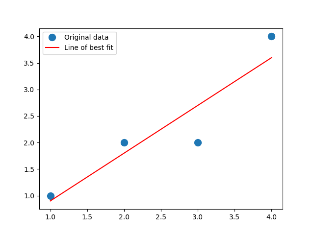

What about `numpy.linalg.lstsq`? Is it any different?
```python
import numpy as np

# Define the matrix X and vector y
X = np.array([[1], [2], [3], [4]])
y = np.array([[1], [2], [2], [4]])

# Augment X with a column of 1's (intercept)
X_aug = np.hstack((np.ones((X.shape[0], 1)), X))

# Solve the least squares equation with matrix X_aug and target y
beta = np.linalg.lstsq(X_aug,y)[0]
```
We then get
```python
>>> beta
array([[6.16291085e-16],
       [9.00000000e-01]])

```
So it is a little different -- and, in fact, closer to our exact answer (the intercept is zero). This makes sense -- `numpy.linalg.lstsq` won't directly compute$1$`X^TX`$, which, again, can cause quite a few issues. 

---

Now  going to our initial example. 

> **Example**: Let us work with the example from above. We augment the matrix with a column of 1's to include an intercept term:
```math
\tilde{X} = \begin{bmatrix} 1 & 1600 & 3 \\ 1 & 2100 & 4 \\ 1 & 1550 & 2 \end{bmatrix}.
```
> Let us solve the normal equations
```math
\tilde{X}^T\tilde{X}\tilde{\beta} = \tilde{X}^Ty.
```
> We have
```math
\tilde{X}^T\tilde{X} = \begin{bmatrix}  3 & 5250 & 9 \\ 5250 & 9372500 & 16300 \\ 9 & 16300 & 29\end{bmatrix} \text{ and } \tilde{X}^Ty = \begin{bmatrix} 1625 \\ 2901500 \\ 5050  \end{bmatrix}.
```
> Solving this system of equations yields the parameter vector$1$`\tilde{\beta}`$. In this case, we have
```math
\tilde{\beta}   = \begin{bmatrix} \frac{200}{9} \\ \frac{5}{18} \\ \frac{100}{9} \end{bmatrix}.
```
> When we apply$1$`\tilde{X}`$ to$1$`\tilde{\beta}`$, we get
```math
\tilde{X}\tilde{\beta} = \begin{bmatrix} 500 \\ 650 \\ 475 \end{bmatrix},
```
> which is our target on the nose. This means that we can expect, based on our data, that the cost of a house will be
```math
\frac{200}{9} + \frac{5}{18}(\text{square footage}) + \frac{100}{9}(\text{\# of bedrooms}).
```

In the above, we actually had a consistent system to begin with, so our least-squares solution gave our prediction honestly. What happens if we have an inconsistent system?

> **Example**: Let us add two more observations, say our data is now the following. 
> |House | Square ft | Bedrooms | Price (in $1000s) |
> | --- | --- | --- | --- |
> | 0 | 1600 | 3 | 500 |
> | 1 | 2100 | 4 | 650 |
> | 2 | 1550 | 2 | 475 |
> | 3 | 1600 | 3 | 490 |
> | 4 | 2000 | 4 | 620 |
> 
> So setting up our system, we want a least-square solution to the matrix equation
```math
\begin{bmatrix}  1 & 1600 & 3 \\ 1 & 2100 & 4 \\ 1 & 1550 & 2 \\ 1 & 1600 & 3 \\ 1 & 2000 & 4  \end{bmatrix}\tilde{\beta} = \begin{bmatrix}  500 \\ 650 \\ 475 \\ 490 \\ 620 \end{bmatrix}.
```
> Note that the system is inconsistent (the 1st and 4th rows agree in$1$`\tilde{X}`$, but they have different costs). Writing the normal equations we have
```math
\tilde{X}^T\tilde{X} = \begin{bmatrix} 5 & 8850 & 16 \\ 8850 & 15932500 & 29100 \\ 16 & 29100 & 54 \end{bmatrix} \text{ and } \tilde{X}y = \begin{bmatrix} 2735 \\ 4 925 250 \\ 9000 \end{bmatrix}.
```
> Solving this linear system yields
```math
\tilde{\beta} = \begin{bmatrix} 0 \\ \frac{3}{10} \\ 5 \end{bmatrix}.
```
> This is a vastly different answer! Applying$1$`\tilde{X}`$ to it yields
```math
\tilde{X}\tilde{\beta} = \begin{bmatrix} 495 \\ 650 \\ 475 \\ 495 \\ 620 \end{bmatrix}.
```
> Note that the error here is
```math
y - \tilde{X}\tilde{\beta} = \begin{bmatrix} 5 \\ 0 \\ 0 \\ -5 \\ 0 \end{bmatrix},
```
> which has squared$1$`L^2`$ norm
```math
\|y - \tilde{X}\tilde{\beta}\|_2^2 = 25 + 25 = 50.
```
> So this says that, given our data, we can roughly estimate the cost of a house, within 50k or so, to be
```math
\approx \frac{3}{10}(\text{square footage}) + 5(\text{\# of bedrooms}).
```
In practice, our data sets can be gigantic, and so there is absolutely no hope of doing computations by hand. It is nice to know that theoretically we can do things like this though. 

> **Theorem**: Let $A$ be an$1$`m \times n`$ matrix and$1$`b \in \mathbb{R}^n`$. The following are equivalent.
> 
> 1.  The equation$1$`Ax = b`$ has a unique least-squares solution for each$1$`b \in \mathbb{R}^n`$.
> 2.  The columns of $A$ are linearly independent.  
> 3.  The matrix$1$`A^TA`$ is invertible.

In this case, the unique solution to the normal equations$1$`A^TAx = A^Tb`$ is

```math
x_0 = (A^TA)^{-1}A^Tb.
```

Computing$1$`\tilde{X}^T\tilde{X}`$ or taking inverses are very computationally intensive tasks, and it is best to avoid doing these. Moreover, as we'll see in an example later, if we do a numerical calculation we can get close to zero and then divide where we shouldn't be, blowing up our final result. One way to get around this is to use QR decompositions of matrices. 

Now let's use python to visualize the above data and then solve for the least-squares solution. We'll use `pandas` in order to think about this data. We note that `pandas` incorporates `matplotlib` under the hood already, so there are some simplifications that can be made.
```python
import numpy as np
import pandas as pd
import matplotlib.pyplot as plt

# First let us make a dictionary incorporating our data.
# Each entry corresponds to a column (feature of our data)
data = {
	'Square ft': [1600, 2100, 1550, 1600, 2000],
	'Bedrooms': [3, 4, 2, 3, 4],
	'Price': [500, 650, 475, 490, 620]
}

# Create a pandas DataFrame
df = pd.DataFrame(data)
```
Let's see how python formats this `DataFrame`. It will turn it into essentially the table we had at the beginning. 
```python
>>> df
   Square ft  Bedrooms  Price
0       1600         3    500
1       2100         4    650
2       1550         2    475
3       1600         3    490
4       2000         4    620
```
So what can we do with DataFrames? First let's use `pandas.DataFrame.describe` to see some basic statistics about our data.
```python
>>> df.describe()
         Square ft  Bedrooms       Price
count     5.000000   5.00000    5.000000
mean   1770.000000   3.20000  547.000000
std     258.843582   0.83666   81.516869
min    1550.000000   2.00000  475.000000
25%    1600.000000   3.00000  490.000000
50%    1600.000000   3.00000  500.000000
75%    2000.000000   4.00000  620.000000
max    2100.000000   4.00000  650.000000
```
This gives use the mean, the  standard deviation, the min, the max, as well as some other things. We get an immediate sense of scale from our data. We can also examine the pairwise correlation of all the columns by using `pandas.DataFrame.corr`.
```python
>>> df[["Square ft", "Bedrooms", "Price"]].corr()
           Square ft  Bedrooms     Price
Square ft   1.000000  0.900426  0.998810
Bedrooms    0.900426  1.000000  0.909066
Price       0.998810  0.909066  1.000000
```
It is clear that each of the three are correlated. This makes sense, as the number of bedrooms should be increasing with the square feet. Same with the price. We'll discuss in the next section when we look at Principal Component Analysis. 

We can also graph our data; for example, we could create some scatter plots, one for `Square ft` vs `Price` and on for `Bedrooms` vs `Price`. We can also do a grouped bar chart. Let's start with the scatter plots. 

```python
# Scatter plot for Price vs Square ft
df.plot(
	kind="scatter",
	x="Square ft",
	y="Price",
	title="House Price vs Square footage"
)
plt.show()
```
```python
# Scatter plot for Price vs Bedrooms
df.plot(
	kind="scatter",
	x="Bedrooms",
	y="Price",
	title="House Price vs Bedrooms"
)
plt.show()
```

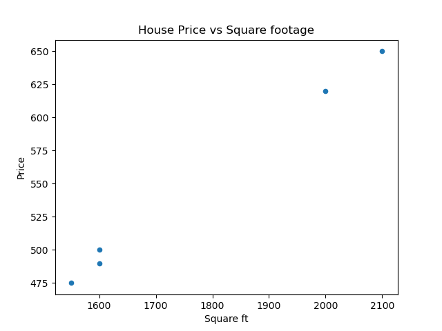

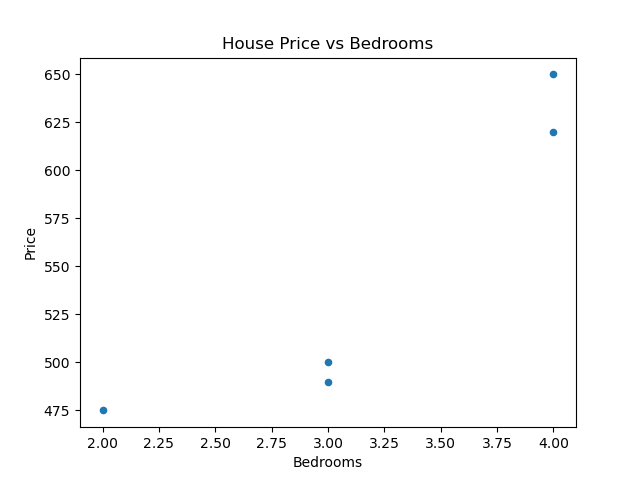

We can even do square footage vs bedrooms. 
```python
# Scatter plot for Bedrooms vs Square ft
df.plot(
	kind="scatter",
	x="Square ft",
	y="Bedrooms",
	title="Bedrooms vs Square footage"
)
plt.show()
```

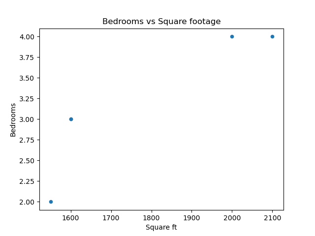)

Of course, these figures are somewhat meaningless due to how unpopulated our data is.

Now let's get our matrices and linear systems set up with `pandas.DataFrame.to_numpy`.

```python
# Create our matrix X and our target y
X = df[["Square ft", "Bedrooms"]].to_numpy()
y = df[["Price"]].to_numpy()

# Augment X with a column of 1's (intercept)
X_aug = np.hstack((np.ones((X.shape[0], 1)), X))

# Solve the least-squares problem
beta = np.linalg.lstsq(X_aug,y)[0]
```
This yields
```python
>>> beta
array([[4.0098513e-13],
       [3.0000000e-01],
       [5.0000000e+00]])

```
As the first parameter is basically 0, we are left with the second being 3/10 and the third being 5, just like our exact solution. Next, we will look at matrix decompositions and how they can help us find least-squares solutions. 

## QR Decompositions

QR decompositions are a powerful tool in linear algebra and data science for several reasons. They provide a way to decompose a matrix into an orthogonal matrix $Q$ aand an upper triangular matrix $R$, which can simplify many computations and analyses.

> **Theorem**: Let $A$ is an$1$`m \times n`$ matrix with linearly independent columns $1$`m \geq n`$ in this case), then $A$ can be decomposed as$1$`A = QR`$ where $Q$ is an$1$`m \times n`$ matrix whose columns form an orthonormal basis for Col($A$) and $R$ is an$1$`n \times n`$ upper-triangular invertible matrix with positive entries on the diagonal.

In the literature, sometimes the QR decomposition is phrased as follows: any$1$`m \times n`$ matrix $A$ can also be written as$1$`A = QR`$ where $Q$ is an$1$`m \times m`$ orthogonal matrix $1$`Q^T = Q^{-1}`$), and $R$ is an$1$`m \times n`$ upper-triangular matrix. One follows from the other by playing around with some matrix equations. Indeed, suppose that$1$`A = Q_1R_1`$ is a decomposition as above (that is,$1$`Q_1`$ is$1$`m \times n`$ and$1$`R_1`$ is$1$`n \times n`$). Use can use the Gram-Schmidt procedure to extend the columns of$1$`Q_1`$ to an orthonormal basis for all of$1$`\mathbb{R}^m`$, and put the remaining vectors in a$1$`(m - n) \times n`$ matrix$1$`Q_2`$. Then

```math
A = Q_1R_1  = \begin{bmatrix} Q_1 & Q_2 \end{bmatrix}\begin{bmatrix} R_1 \\ 0 \end{bmatrix}. 
```

The left matrix is an$1$`m \times m`$ orthogonal matrix and the right matrix is$1$`m \times n`$ upper triangular. Moreover, the decomposition provides orthonormal bases for both the column space of $A$ and the perp of the column space of $A$;$1$`Q_1`$ will consist of an orthonormal basis for the column space of $A$ and$1$`Q_2`$ will consist of an orthonormal basis for the perp of the column space of $A$. 

However, we will often want to use the decomposition when $Q$ is$1$`m \times n`$, $R$ is$1$`n \times n`$, and the columns of $Q$ form an orthonormal basis for the column space of $A$. For example, the python function `numpy.linalg.qr` give QR decompositions this way (again, assuming that the columns of $A$ are linearly independent, so$1$`m \geq n`$).

> **Key take-away**. The QR decomposition provides an orthonormal basis for the column space of $A$. If $A$ has rank $k$, then the first $k$ columns of $Q$ will form a basis for the column space of $A$. 

For small matrices, one can find $Q$ and $R$ by hand, assuming that$1$`A = [ a_1\  \cdots\ a_n ]`$ has full column rank. Let$1$`e_1,\dots,e_n`$ be the unnormalized vectors we get when we apply Gram-Schmidt to$1$`c_1,\dots,c_n`$, and let$1$`u_1,\dots,u_n`$ be their normalizations. Let
```math
r_j = \begin{bmatrix} \langle e_1,c_j  \rangle  \\ \vdots \\ \langle e_n, c_j \rangle \end{bmatrix},
```
and note that$1$`\langle e_i,c_j \rangle = 0`$ whenever$1$`i > j`$. Thus
```math
Q = \begin{bmatrix} u_1 & \cdots & u_n \end{bmatrix} \text{ and } R = \begin{bmatrix} r_1 & \cdots & r_n \end{bmatrix}
```
give rise to a$1$`A = QR`$, where the columns of $Q$ form an orthonormal basis for$1$`\text{Col}(A)`$ and $R$ is upper-triangular. We can also compute $R$ directly from $Q$ and $Q$. Indeed, note that$1$`Q^TQ = I`$, so
```math
Q^TA = Q^T(QR) = IR = R.
```

> **Example**. Find a QR decomposition for the matrix
```math
A = \begin{bmatrix} 1 & 1 & 1 \\ 0 & 1 & 1 \\ 0 & 0 & 1 \\ 0 & 0  & 0 \end{bmatrix}.
```
> Note that one trivially see (or by applying the Gram-Schmidt procedure) that
```math
\begin{bmatrix} 1 \\ 0 \\ 0 \\ 0 \end{bmatrix}, \begin{bmatrix} 0 \\ 1 \\ 0 \\ 0 \end{bmatrix}, \begin{bmatrix} 0 \\ 0 \\ 1 \\ 0 \end{bmatrix}
```
> forms an orthonormal basis for the column space of $A$. So with
```math
Q = \begin{bmatrix} 1 & 0 & 0 \\ 0 & 1 & 0 \\ 0 & 0 & 1 \\ 0 & 0 & 0 \end{bmatrix} \text{ and }R = \begin{bmatrix} 1 & 1 & 1\\ 0 & 1 & 1 \\ 0 & 0 & 1 \end{bmatrix},
```
> we have$1$`A = QR`$.

Let's do a more involved example.
> **Example**. Consider the matrix
```math
A = \begin{bmatrix} 1 & 0 & 0 \\ 1 & 1 & 0 \\ 1 & 1 & 1 \\ 1 & 1 & 1 \end{bmatrix}.
```
> One can apply the Gram-Schmidt procedure to the columns of $A$ to find that
```math
\begin{bmatrix} 1 \\ 1 \\ 1 \\ 1 \end{bmatrix}, \begin{bmatrix} -3 \\ 1 \\ 1 \\ 1 \end{bmatrix}, \begin{bmatrix} 0 \\ -\frac{2}{3} \\ \frac{1}{3} \\ \frac{1}{3}\end{bmatrix}
```
> forms an orthogonal basis for the column space of $A$. Normalizing, we get that
```math
Q = \begin{bmatrix} \frac{1}{2} & -\frac{3}{\sqrt{12}} & 0 \\ \frac{1}{2} & \frac{1}{\sqrt{12}} & -\frac{2}{\sqrt{6}} \\ \frac{1}{2} & \frac{1}{\sqrt{12}} & \frac{1}{\sqrt{6}} \\ \frac{1}{2} & \frac{1}{\sqrt{12}} & \frac{1}{\sqrt{6}} \end{bmatrix}
```
> is an appropriate $Q$. Thus
```math
\begin{split} R = Q^TA &= \begin{bmatrix} \frac{1}{2} & \frac{1}{2} & \frac{1}{2} & \frac{1}{2} \\ -\frac{3}{\sqrt{12}} & \frac{1}{\sqrt{12}} & \frac{1}{\sqrt{12}} & \frac{1}{\sqrt{12}} \\ 0 & -\frac{2}{\sqrt{6}} & \frac{1}{\sqrt{6}} & \frac{1}{\sqrt{6}} \end{bmatrix}\begin{bmatrix} 1 & 0 & 0 \\ 1 & 1 & 0 \\ 1 & 1 & 1 \\ 1 & 1 & 1 \end{bmatrix} \\ &= \begin{bmatrix} 2 & \frac{3}{2} & 1 \\ 0 & \frac{3}{\sqrt{12}} & \frac{2}{\sqrt{12}} \\ 0 & 0 & \frac{2}{\sqrt{6}} \end{bmatrix}. \end{split}
```
> So all together,
```math
A =  \begin{bmatrix} \frac{1}{2} & -\frac{3}{\sqrt{12}} & 0 \\ \frac{1}{2} & \frac{1}{\sqrt{12}} & -\frac{2}{\sqrt{6}} \\ \frac{1}{2} & \frac{1}{\sqrt{12}} & \frac{1}{\sqrt{6}} \\ \frac{1}{2} & \frac{1}{\sqrt{12}} & \frac{1}{\sqrt{6}} \end{bmatrix}\begin{bmatrix} 2 & \frac{3}{2} & 1 \\ 0 & \frac{3}{\sqrt{12}} & \frac{2}{\sqrt{12}} \\ 0 & 0 & \frac{2}{\sqrt{6}} \end{bmatrix}.
```

To do this numerically, we can use `numpy.linalg.qr`.

```python
# Define our matrices
A = np.array([[1,1,1],[0,1,1],[0,0,1],[0,0,0]])
B = np.array([[1,0,0],[1,1,0],[1,1,1],[1,1,1]])

# Take QR decompositions
QA, RA = np.linalg.qr(A)
QB, RB = np.linalg.qr(B)
```
Our resulting matrices are:
```python
>>> QA
array([[ 1.,  0.,  0.],
       [-0.,  1.,  0.],
       [-0., -0.,  1.],
       [-0., -0., -0.]])
>>> RA
array([[1., 1., 1.],
       [0., 1., 1.],
       [0., 0., 1.]])
>>> QB
array([[-0.5       ,  0.8660254 ,  0.        ],
       [-0.5       , -0.28867513,  0.81649658],
       [-0.5       , -0.28867513, -0.40824829],
       [-0.5       , -0.28867513, -0.40824829]])
>>> RB
array([[-2.        , -1.5       , -1.        ],
       [ 0.        , -0.8660254 , -0.57735027],
       [ 0.        ,  0.        , -0.81649658]])

```

### How to use QR decompositions

One of the primary uses of QR decompositions is to solve least squares problems, as introduced above. Assuming that $A$ has full column rank, we can write$1$`A = QR`$ as a QR decomposition, and then we can find a least-squares solution to$1$`Ax = b`$ by solving the upper-triangular system.

> **Theorem**. Let $A$ be an$1$`m \times n`$ matrix with full column rank, and let$1$`A = QR`$ be a QR factorization of $A$. Then, for each$1$`b \in \mathbb{R}^m`$, the equation$1$`Ax = b`$ has a unique least-squares solution, arising from the system
```math
Rx = Q^Tb.
```

Normal equations can be *ill-conditioned*, i.e., small errors in calculating$1$`A^TA`$ give large errors when trying to solve the least-squares problem. When $A$ has full column rank, a QR factorization will allow one to compute a solution to the least-squares problem more reliably. 

> **Example**. Let
```math
A = \begin{bmatrix} 1 & 0 & 0 \\ 1 & 1 & 0 \\ 1 & 1 & 1 \\ 1 & 1 & 1 \end{bmatrix} \text{ and } b = \begin{bmatrix} 1 \\ 1 \\ 1 \\ 0 \end{bmatrix}.
```
> We can find the least-squares solution$1$`Ax = b`$ by using the QR decomposition. Let us use the QR decomposition from above, and solve the system
```math
Rx = Q^Tb.
```
> As
```math
\begin{bmatrix} \frac{1}{2} & -\frac{3}{\sqrt{12}} & 0 \\ \frac{1}{2} & \frac{1}{\sqrt{12}} & -\frac{2}{\sqrt{6}} \\ \frac{1}{2} & \frac{1}{\sqrt{12}} & \frac{1}{\sqrt{6}} \\ \frac{1}{2} & \frac{1}{\sqrt{12}} & \frac{1}{\sqrt{6}} \end{bmatrix}^T\begin{bmatrix} 1 \\ 1 \\ 1 \\ 0 \end{bmatrix} = \begin{bmatrix} \frac{3}{2} \\ -\frac{1}{2\sqrt{3}} \\ -\frac{1}{\sqrt{6}}, \end{bmatrix}
```
> we are looking at the system
```math
\begin{bmatrix} 2 & \frac{3}{2} & 1 \\ 0 & \frac{3}{\sqrt{12}} & \frac{2}{\sqrt{12}} \\ 0 & 0 & \frac{2}{\sqrt{6}} \end{bmatrix}x  =\begin{bmatrix} \frac{3}{2} \\ -\frac{1}{2\sqrt{3}} \\ -\frac{1}{\sqrt{6}} \end{bmatrix}.
```
> Solving this system yields that
```math
x_0 = \begin{bmatrix} 1 \\ 0 \\ -\frac{1}{2} \end{bmatrix}
```
> is a least-squares solution to$1$`Ax = b`$.

Let us set this system up in python and use `numpy.linalg.solve`. 

```python
import numpy as np

# Define matrix and vector
A = np.array([[1,0,0],[1,1,0],[1,1,1],[1,1,1]])
b = np.array([[1],[1],[1],[0]])

# Take the QR decomposition of A
Q, R = np.linalg.qr(A)

# Solve the linear system Rx = Q.T b
beta = np.linalg.solve(R,Q.T @ b)
```
This yields
```python
>>> beta
array([[ 1.00000000e+00],
       [ 6.40987562e-17],
       [-5.00000000e-01]])

```
which agrees with our exact least-squares solution.
Note that  `numpy.linalg.lstsq` still gives a **ever so slightly** different result. 
```python
>>> np.linalg.lstsq(A,b)[0]
array([[ 1.00000000e+00],
       [ 2.22044605e-16],
       [-5.00000000e-01]])
```

---

Let's go back to the house example. While we're at it, let's get used to using pandas to make a dataframe. 
```python
import numpy as np
import pandas as pd

# First let us make a dictionary incorporating our data.
# Each entry corresponds to a column (feature of our data)
data = {
    'Square ft': [1600, 2100, 1550, 1600, 2000],
    'Bedrooms': [3, 4, 2, 3, 4],
    'Price': [500, 650, 475, 490, 620]
}

# Create a pandas DataFrame
df = pd.DataFrame(data)

# Create our matrix X and our target y
X = df[["Square ft", "Bedrooms"]].to_numpy()
y = df[["Price"]].to_numpy()

# Augment X with a column of 1's (intercept)
X_aug = np.hstack((np.ones((X.shape[0], 1)), X))

# Perform QR decomposition
Q, R = np.linalg.qr(X_aug)

# Solve the upper triangular system Rx = Q^Ty
beta = np.linalg.solve(R, Q.T @ y)
```
Let's look at the output.
```python
>>> Q
array([[-0.4472136 ,  0.32838365,  0.40496317],
       [-0.4472136 , -0.63745061, -0.22042299],
       [-0.4472136 ,  0.42496708, -0.7689174 ],
       [-0.4472136 ,  0.32838365,  0.40496317],
       [-0.4472136 , -0.44428376,  0.17941406]])
>>> R
array([[-2.23606798e+00, -3.95784032e+03, -7.15541753e+00],
       [ 0.00000000e+00, -5.17687164e+02, -1.50670145e+00],
       [ 0.00000000e+00,  0.00000000e+00,  7.27908474e-01]])
>>> beta
array([-3.05053797e-13,  3.00000000e-01,  5.00000000e+00])
```
As we can see, the least-squares solution agrees with what we got by hand and by other python methods (if we agree that the tiny first component is essentially zero).

---

The QR decomposition of a matrix is also useful for computing orthogonal projections.
> **Theorem**. Let $A$ be an$1$`m \times n`$ matrix with full column rank. If$1$`A = QR`$ is a QR decomposition, then$1$`QQ^T`$ is the projection onto the column space of $A$, i.e.,$1$`QQ^Tb = \text{Proj}_{\text{Col}(A)}b`$ for all$1$`b \in \mathbb{R}^m`$.

Let's see what our range projections are for the matrices above. Note that the first example above will have the orthogonal projection just being
```math
\begin{bmatrix} 1 \\ & 1 \\ & & 1\\ & & & 0 \end{bmatrix}.
```
Let's look at the other matrix. 

> **Example**. Working with the matrix
```math
A = \begin{bmatrix} 1 & 0 & 0 \\ 1 & 1 & 0 \\ 1 & 1 & 1 \\ 1 & 1 & 1 \end{bmatrix},
```
> the projection onto the column space if given by
```math
QQ^T = \begin{bmatrix} 1 \\ & 1 \\ & & \frac{1}{2} & \frac{1}{2} \\ & & \frac{1}{2} & \frac{1}{2} \end{bmatrix}.
```
> This is a well-understood projection: it is the direct sum of the identity on$1$`\mathbb{R}^2`$ and the projection onto the line$1$`y = x`$ in$1$`\mathbb{R}^2`$.

Now let's use python to implement the projection.

```python
import numpy as np

# Create our matrix A
A = np.array([[1,0,0],[1,1,0],[1,1,1],[1,1,1]])

# Take the QR decomposition
Q, R = np.linalg.qr(A)

# Create the range projection
P = Q @ Q.T
```
The output gives
```python
array([[1.00000000e+00, 2.89687929e-17, 2.89687929e-17, 2.89687929e-17],
       [2.89687929e-17, 1.00000000e+00, 7.07349921e-17, 7.07349921e-17],
       [2.89687929e-17, 7.07349921e-17, 5.00000000e-01, 5.00000000e-01],
       [2.89687929e-17, 7.07349921e-17, 5.00000000e-01, 5.00000000e-01]])

```
As we can see, the two off-diagonal blocks are all tiny, hence we treat them as zero. Note that if they were not actually zero, then this wouldn't actually be a projection. This can cause some problems. So let's fix this by introducing some tolerances. 

Let's write a function to implement this, assuming that columns of A are linearly independent. 

```python
import numpy as np

def proj_onto_col_space(A):
	# Take the QR decomposition
	Q,R = np.linalg.qr(A)
	# The projection is just Q @ Q.T
	P = Q @ Q.T

	return P
```
We'll come back to this later. We should really be incorporating some sort of error tolerance so that things are **super super** tiny can actually just be sent to zero. 

> **Remark**. Another way to get the projection onto the column space of an$1$`n \times p`$ matrix $A$ of full column rank is to take
```math
P = A(A^TA)^{-1}A^T.
```
> Indeed, let$1$`b \in \mathbb{R}^n`$ and let$1$`x_0 \in \mathbb{R}^p`$ be a solution to the normal equations
```math
A^TAx_0 = A^Tb.
```
> Then$1$`x_0 = (A^TA)^{-1}A^Tb`$ and so$1$`Ax_0 = A(A^TA^{-1})A^Tb`$ is the (unique!) vector in the column space of $A$ which is closest to $b$, i.e., the projection of $b$ onto the column space of $A$.
> However, taking transposes, multiplying, and inverting is not what we would like to do numerically. 

## Singular Value Decomposition

The SVD is a very important matrix decomposition in both data science and linear algebra.

> **Theorem**. For any matrix$1$`n \times p`$ matrix $X$, there exist an orthogonal$1$`n \times n`$ matrix $U$, an orthogonal$1$`p \times p`$ matrix $V$, and a diagonal$1$`n \times p`$ matrix$1$`\Sigma`$ with non-negative entries such that
```math
X = U\Sigma V^T.
```
> - The columns of $U$ are left **left singular vectors**.
> - The columns of $V$ are the **right singular vectors**.
> -$1$`\Sigma`$ has **singular values**$1$`\sigma_1 \geq \sigma_2 \geq \cdots \geq \sigma_r > 0`$ on its diagonal, where $r$ is the rank of $X$.

> **Remark**. The SVD is clearly a generalization of matrix diagonalization, but it also generalizes the **polar decomposition** of a matrix. Recall that every$1$`n \times n`$ matrix $A$ can be written as$1$`A = UP`$ where $U$ is orthogonal (or unitary) and $P$ is a positive matrix. This is because if
```math
A = U_0\Sigma V^T
```
> is the SVD for $A$, then$1$`\Sigma`$ is an$1$`n \times n`$ diagonal matrix with non-negative entries, hence any orthogonal conjugate of it is positive, and so
```math
A = (U_0V^T)(V\Sigma V^T).
```
> Take$1$`U = U_0V^T`$ and$1$`P = V\Sigma V^T`$. 

By hand, the algorithm for computing an SVD is as follows.
1. Both$1$`AA^T`$ and$1$`A^TA`$ are symmetric (they are positive in fact), and so they can be orthogonally diagonalized; one can form an orthogonal basis of eigenvectors. Let$1$`v_1,\dots,v_p`$ be an orthonormal basis of eigenvectors for$1$`\mathbb{R}^p`$ which correspond to eigenvectors of$1$`A^TA`$ in decreasing order. Suppose that$1$`A^TA`$ has $r$ non-zero eigenvalues. Let $V$ be the matrix whose columns contain the$1$`v_i`$'s. This gives our right singular vectors and our singular values. 
2. Let$1$`u_i = \frac{1}{\sigma_i}Av_i`$ for$1$`i = 1,\dots,r`$, and extend this collection of vectors to an orthonormal basis for$1$`\mathbb{R}^n`$ if necessary. Let $U$ be the corresponding matrix.
3. Let$1$`\Sigma`$ be the$1$`n \times p`$ matrix whose diagonal entries are$1$`\sigma_1 \geq \sigma_2 \geq \cdots \geq \sigma_r`$, and then zeroes if necessary. 

> **Example**. Let us compute the SVD of
```math
A = \begin{bmatrix} 3 & 2 & 2 \\ 2 & 3 & -2 \end{bmatrix}.
```
> First we note that
```math
A^TA = \begin{bmatrix} 13 & 12 & 2 \\ 12 & 13 & -2 \\ 2 & -2 & 8 \end{bmatrix},
```
> which has eigenvalues$1$`25,9,0`$ with corresponding eigenvectors
```math
\begin{bmatrix} 1 \\ 1 \\ 0 \end{bmatrix}, \begin{bmatrix} 1 \\ -1 \\ 4 \end{bmatrix}, \begin{bmatrix} -2 \\ 2 \\ 1 \end{bmatrix}.
```
> Normalizing, we get
```math
V = \begin{bmatrix} \frac{1}{\sqrt{2}} & \frac{1}{3\sqrt{2}} & -\frac{2}{3} \\ \frac{1}{\sqrt{2}} & -\frac{1}{3\sqrt{2}} & \frac{2}{3} \\ 0 & \frac{4}{3\sqrt{2}} & \frac{1}{3} \end{bmatrix}.
```
> Now we set$1$`u_1 = \frac{1}{5}Av_1`$ and$1$`u_2 = \frac{1}{3}Av_2`$ to get
```math
U = \begin{bmatrix} \frac{1}{\sqrt{2}} & \frac{1}{\sqrt{2}} \\ \frac{1}{\sqrt{2}} & -\frac{1}{\sqrt{2}} \end{bmatrix}.
```
> So
```math
A = \begin{bmatrix} \frac{1}{\sqrt{2}} & \frac{1}{\sqrt{2}} \\ \frac{1}{\sqrt{2}} & -\frac{1}{\sqrt{2}} \end{bmatrix} \begin{bmatrix} 5 & 0 & 0 \\ 0 & 3 & 0 \end{bmatrix} \begin{bmatrix} \frac{1}{\sqrt{2}} & \frac{1}{3\sqrt{2}} & -\frac{2}{3} \\ \frac{1}{\sqrt{2}} & -\frac{1}{3\sqrt{2}} & \frac{2}{3} \\ 0 & \frac{4}{3\sqrt{2}} & \frac{1}{3} \end{bmatrix}^T
```
> is our SVD decomposition.

We note that in practice, we avoid the computation of$1$`X^TX`$ because if the entries of $X$ have errors, then these errors will be squared in$1$`X^TX`$. There are better computational tools to get singular values and singular vectors which are more accurate. This is what our python tools will use. 

Let's use `numpy.linalg.svd` for the above matrix.

```python
import numpy as np

#Define our matrix
A = np.array([[3,2,2],[2,3,-2]])

# Take the SVD
U, S, Vh = np.linalg.svd(A)
```
Our SVD matrices are
```python
>>> U
array([[-0.70710678, -0.70710678],
       [-0.70710678,  0.70710678]])
>>> S
array([5., 3.])
# Note that Vh already gives the transpose of the matrix V we get
# in our SVD. So we'll take the transpose again to get
# the appropriate rows
>>> Vh.T
array([[-7.07106781e-01, -2.35702260e-01, -6.66666667e-01],
       [-7.07106781e-01,  2.35702260e-01,  6.66666667e-01],
       [-6.47932334e-17, -9.42809042e-01,  3.33333333e-01]])
```


Because the eigenvalues of the hermitian squares of
```math
\begin{bmatrix} 1 & 1 & 1\\ 0 & 1 & 1 \\ 0 & 0 & 1 \\ 0 & 0 & 0 \end{bmatrix} \text{ and } \begin{bmatrix} 1 & 0 & 0 \\ 1 & 1 & 0 \\ 1 & 1 & 1 \\ 1 & 1 & 1 \end{bmatrix}
```
are quite atrocious, an exact SVD decomposition is difficult to compute by hand. However, we can of course use python.

```python
import numpy as np

# Define our matrices
A = np.array([[1,1,1],[0,1,1],[0,0,1],[0,0,0]])
B = np.array([[1,0,0],[1,1,0],[1,1,1],[1,1,1]])

# SVD decomposition
U_A, S_A, Vh_A = np.linalg.svd(A)
U_B, S_B, Vh_B = np.linalg.svd(B)
```
The resulting matrices are
```python
>>> U_A
array([[ 0.73697623,  0.59100905,  0.32798528,  0.        ],
       [ 0.59100905, -0.32798528, -0.73697623,  0.        ],
       [ 0.32798528, -0.73697623,  0.59100905,  0.        ],
       [ 0.        ,  0.        ,  0.        ,  1.        ]])
>>> S_A
array([2.2469796 , 0.80193774, 0.55495813])
>>> Vh_A.T
array([[ 0.32798528,  0.73697623,  0.59100905],
       [ 0.59100905,  0.32798528, -0.73697623],
       [ 0.73697623, -0.59100905,  0.32798528]])
>>> U_B
array([[-2.41816250e-01,  7.12015746e-01, -6.59210496e-01,
         0.00000000e+00],
       [-4.52990541e-01,  5.17957311e-01,  7.25616837e-01,
         6.71536163e-17],
       [-6.06763739e-01, -3.35226641e-01, -1.39502200e-01,
        -7.07106781e-01],
       [-6.06763739e-01, -3.35226641e-01, -1.39502200e-01,
         7.07106781e-01]])
>>> S_B
array([2.8092118 , 0.88646771, 0.56789441])
>>> Vh_B.T
array([[-0.67931306,  0.63117897, -0.37436195],
       [-0.59323331, -0.17202654,  0.7864357 ],
       [-0.43198148, -0.75632002, -0.49129626]])
```

Another final note is that the **operator norm** of a matrix $A$ agrees with its largest singular value. 

### Pseudoinverses and using the SVD
The SVD can be used to determine a least-squares solution for a given system. Recall that if$1$`v_1,\dots,v_p`$ is an orthonormal basis for$1$`\mathbb{R}^p`$ consisting of eigenvectors of$1$`A^TA`$, arranged so that they correspond to eigenvalues$1$`\sigma_1 \geq \sigma_2 \geq \cdots \geq \sigma_r`$, then$1$`\{Av_1,\dots,Av_r\}`$ is an orthogonal basis for the column space of $A$. In essence, this means that when we have our left singular vectors$1$`u_1,\dots,u_n`$ (constructed based on our algorithm as above), we have that the first $r$ vectors form an orthonormal basis for the column space of $A$, and that the remaining$1$`n - r`$ vectors form an orthonormal basis for the perp of the column space of $A$ (which is also equal to the nullspace of$1$`A^T`$). 

> **Definition**. Let $A$ be an$1$`n \times p`$ matrix and suppose that the rank of $A$ is$1$`r \leq \min\{n,p\}`$. Suppose that$1$`A = U\Sigma V^T`$ is the SVD, where the singular values are decreasing. Partition
```math
U = \begin{bmatrix} U_r & U_{n-r} \end{bmatrix} \text{ and } V = \begin{bmatrix} V_r & V_{p-r} \end{bmatrix}
```
> into submatrices, where$1$`U_r`$ and$1$`V_r`$ are the matrices whose columns are the first $r$ columns of $U$ and $V$ respectively. So$1$`U_r`$ is$1$`n \times r`$ and$1$`V_r`$ is$1$`p \times r`$. Let $D$ be the diagonal$1$`r \times r`$ matrices whose diagonal entries are$1$`\sigma_1,\dots, \sigma_r`$, so that
```math
\Sigma = \begin{bmatrix} D & 0  \\ 0 & 0 \end{bmatrix}
```
> and note that
```math
A = U_rDV_r^T.
```
> We call this the reduced singular value decomposition of $A$. Note that $D$ is invertible, and its inverse is simply
```math
D = \begin{bmatrix} \sigma_1^{-1} \\ & \sigma_2^{-1} \\ & & \ddots \\ & & & \sigma_r^{-1} \end{bmatrix}.
```
> The **pseudoinverse** (or **Moore-Penrose inverse**) of $A$ is the matrix
```math
A^+ = V_rD^{-1}U_r^T.
```

We note that the pseudoinverse$1$`A^+`$ is a$1$`p \times n`$ matrix. 

With the pseudoinverse, we can actually find least-squares solutions quite easily. Indeed, if we are looking for the least-squares solution to the system$1$`Ax = b`$, define
```math
x_0 = A^+b.
```
Then 
```math
\begin{split} Ax_0 &= (U_rDV_r^T)(V_rD^{-1}U_r^Tb) \\ &=  U_rDD^{-1}U_r^Tb \\ &= U_rU_r^Tb \end{split}
```
As mentioned before, the columns of$1$`U_r`$ form an orthonormal basis for the column space of $A$ and so$1$`U_rU_r^T`$ is the orthogonal projection onto the range of $A$. That is,$1$`Ax_0`$ is precisely the projection of $b$ onto the column space of $A$, meaning that this yields a least-squares solution. This gives the following.

> **Theorem**. Let $A$ be an$1$`n \times p`$ matrix and$1$`b \in \mathbb{R}^n`$. Then
```math
x_0 = A^+b
```
> is a least-squares solution to$1$`Ax = b`$. 

Taking pseudoinverses is quite involved. We'll do one example by hand, and then use python -- and we'll see something go wrong! There is a function `numpy.linalg.pinv` in numpy that will take a pseudoinverse. We can also just use `numpy.linalg.svd` and do the process above.

> **Example**. We have the following SVD$1$`A = U\Sigma V^T`$. 
```math
\begin{bmatrix} 1 & 1 & 2\\ 0 & 1 & 1  \\ 1 & 0 & 1 \\ 0 & 0 & 0 \end{bmatrix} = \begin{bmatrix} \sqrt{\frac{2}{3}} & 0 & 0 & -\frac{1}{\sqrt{3}} \\ \frac{1}{\sqrt{6}} & \frac{1}{\sqrt{2}} & 0 & \frac{1}{\sqrt{3}} \\  \frac{1}{\sqrt{6}} & -\frac{1}{\sqrt{2}} & 0 & \frac{1}{\sqrt{3}} \\ 0 & 0 & 1 & 0 \end{bmatrix} \begin{bmatrix} 3 & 0 & 0 \\ 0 & 1 & 0 \\ 0 & 0  & 0 \\ 0 & 0 & 0 \end{bmatrix}\begin{bmatrix} \frac{1}{\sqrt{6}} & -\frac{1}{\sqrt{2}} & -\frac{1}{\sqrt{3}} \\ \frac{1}{\sqrt{6}} & \frac{1}{\sqrt{2}} & -\frac{1}{\sqrt{3}} \\ \sqrt{\frac{2}{3}} & 0 & \frac{1}{\sqrt{3}} \end{bmatrix}^T.
```
> Can we find a least-squares solution to$1$`Ax = b`$, where
```math
b = \begin{bmatrix} 1 \\ 1 \\ 1 \\ 1 \end{bmatrix}?
```
> The pseudoinverse of $A$ is
```math
\begin{split} A^+ &= \begin{bmatrix} \frac{1}{\sqrt{6}} & -\frac{1}{\sqrt{2}} \\ \frac{1}{\sqrt{6}} & \frac{1}{\sqrt{2}} \\ \sqrt{\frac{2}{3}} & 0 \end{bmatrix} \begin{bmatrix} 3 \\ & 1 \end{bmatrix} \begin{bmatrix} \sqrt{\frac{2}{3}} & 0 \\ \frac{1}{\sqrt{6}} & \frac{1}{\sqrt{2}} \\ \frac{1}{\sqrt{6}} & -\frac{1}{\sqrt{2}} \\ 0 & 0 \end{bmatrix}^T \\ &= \begin{bmatrix} \frac{1}{9} & -\frac{4}{9} & \frac{5}{9} & 0 \\  \frac{1}{9} & \frac{5}{9} & -\frac{4}{9} & 0 \\ \frac{2}{9} & \frac{1}{9} & \frac{1}{9} & 0\end{bmatrix},  \end{split}
```
> and so a least-squares solution is given by
```math
\begin{split} x_0 &= A^+b \\ &= \begin{bmatrix} \frac{1}{9} & -\frac{4}{9} & \frac{5}{9} & 0 \\  \frac{1}{9} & \frac{5}{9} & -\frac{4}{9} & 0 \\ \frac{2}{9} & \frac{1}{9} & \frac{1}{9} & 0\end{bmatrix}\begin{bmatrix} 1 \\ 1 \\ 1 \\ 1 \end{bmatrix} \\ &= \begin{bmatrix} \frac{2}{9} \\ \frac{2}{9} \\ \frac{4}{9} \end{bmatrix}.  \end{split}
```

Now let's do this with python, and see an example of how things can go wrong. We'll try to take the pseudoinverse manually first.

```python
import numpy as np

# Create our matrix A and our target b
A = np.array([[1,1,2],[0,1,1],[1,0,1],[0,0,0]])
b = np.array([[1],[1],[1],[1]])

# Take the SVD decomposition
U, S, Vh = np.linalg.svd(A)

# Prepare the pseudoinverse
# Recall that we invert the non-zero diagonal entries of the diagonal matrix.
# So we first build S_inv to be the appropriate size
S_inv = np.zeros((Vh.shape[0], U.shape[0])) 
# We then fill in the appropriate values on the diagonal
S_inv[:len(S), :len(S)] = np.diag(1/S)

# Build the pseudoinverse
A_pinv = Vh.T @ S_inv @ U.T

# Compute the least-squares solution
beta = A_pinv @ b
```
What is the result?	
```python
>>> beta
array([[ 2.74080345e+15],
       [ 2.74080345e+15],
       [-2.74080345e+15]])

```
This is **WAY** off the mark. So what happened? Well, when we look at our singular values, we have
```python
>>> S
array([3.00000000e+00, 1.00000000e+00, 1.21618839e-16])
```
As we got this matrix numerically, the last entry is actually non-zero, but tiny. This isn't exactly what's going on since we know that the rank of A is 2. So when we invert the singular values and throw them on the diagonal, have `1/1.21618839e-16` which is a very large value. This value then messes up the rest of the computation. So how do we fix this? One can set tolerances in numpy, but we'll get to that later. Let's just note that `numpy.linalg.pinv` will already incorporate this. Let's see what we get.

```python
import numpy as np

# Create our matrix A and our target b
A = np.array([[1,1,2],[0,1,1],[1,0,1],[0,0,0]])
b = np.array([[1],[1],[1],[1]])

# Build the pseudoinverse
A_pinv = np.linalg.pinv(A)

# Compute the least-squares solution
beta = A_pinv @ b
```
```python
>>> A_pinv
array([[ 0.11111111, -0.44444444,  0.55555556,  0.        ],
       [ 0.11111111,  0.55555556, -0.44444444,  0.        ],
       [ 0.22222222,  0.11111111,  0.11111111,  0.        ]])
>>> beta
array([[0.22222222],
       [0.22222222],
       [0.44444444]])
```

### The Condition Number
Numerical calculations involving matrix equations are quite reliable if we use the SVD. This is because the orthogonal matrices $U$ and $V$ preserve lengths and angles, leaving the stability of the problem to be governed by the singular values of the matrix $X$. Recall that if$1$`X = U\Sigma V^T`$, then solving the least-squares problem involves dividing by the non-zero singular values$1$`\sigma_i`$ of $X$. If these values are very small, their inverses become very large, and this will amplify any numerical errors.

> **Definition**. Let $X$ be an$1$`n \times p`$ matrix and let$1$`\sigma_1 \geq \cdots \geq \sigma_r`$ be the non-zero singular values of $X$. The **condition number** of $X$ is the quotient
```math
\kappa(X) = \frac{\sigma_1}{\sigma_r}
```
> of the largest and smallest non-zero singular values.

A condition number close to 1 indicates a well-conditioned problem, while a large condition number indicates that small perturbations in data may lead to large changes in computation. Geometrically,$1$`\kappa(X)`$ measures how much $X$ distorts space. 

> **Example**. Consider the matrices
```math
A = \begin{bmatrix} 1 \\ & 1 \end{bmatrix} \text{ and } B = \begin{bmatrix} 1 \\ & \frac{1}{10^6} \end{bmatrix}.
```
> The condition numbers are
```math
\kappa(A) = 1 \text{ and } \kappa(B) = 10^6.
```
> Inverting$1$`X_2`$ includes dividing by$1$`\frac{1}{10^6}`$, which will amplify errors by$1$`10^6`$.

Let's look our main example in python by using `numpy.linalg.cond`. 

```python
import numpy as np
import pandas as pd

# First let us make a dictionary incorporating our data.
# Each entry corresponds to a column (feature of our data)
data = {
    'Square ft': [1600, 2100, 1550, 1600, 2000],
    'Bedrooms': [3, 4, 2, 3, 4],
    'Price': [500, 650, 475, 490, 620]
}

# Create a pandas DataFrame
df = pd.DataFrame(data)

# Create out matrix X
X = df[['Square ft', 'Bedrooms']].to_numpy()

# Check the condition number
cond_X = np.linalg.cond(X)
```
Let's see what we got.
```python
>>> cond_X
np.float64(4329.082589067693)
```
so this is quite a high condition number! This should be unsurprising, as clearly the number of bedrooms is correlated to the size of a house (especially so in our small toy example). 
## A note on other norms

There are other canonical choices of norms for vectors and matrices. While$1$`L^2`$ leads naturally to least-squares problems with closed-form solutions, other norms induce different geometries and different optimal solutions. From the linear algebra perspective, changing the norm affects:
- the shape of the unit ball,
- the geometry of approximation,
- the numerical behaviour of optimization problems. 

###$1$`L^1`$ norm (Manhattan distance)
The$1$`L^1`$ norm of a vector$1$`x = (x_1,\dots,x_p) \in \mathbb{R}^p`$ is defined as
```math
\|x\|_1 = \sum |x_i|.
```
Minimizing the$1$`L^1`$ norm is less sensitive to outliers. Geometrically, the$1$`L^1`$ unit ball in$1$`\mathbb{R}^2`$ is a diamond (a rotated square), rather than a circle.

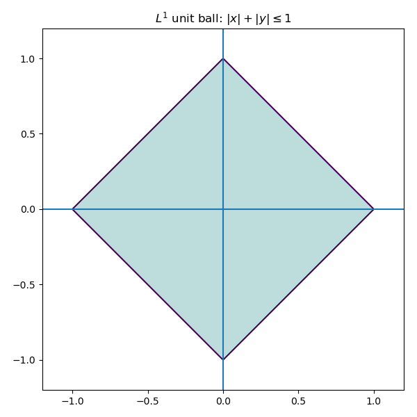)

Consequently, optimization problems involving$1$`L^1`$ tend to produce solutions which live on the corners of this polytope.
Solutions often require linear programming or iterative reweighted least squares.

$1$`L^1`$ based methods (such as LASSO) tend to set coefficients to be exactly zero. Unlike with$1$`L^2`$, the minimization problem for$1$`L^1`$ does not admit a closed form solution. Algorithms include:
- linear programming formulations,
- iterative reweighted least squares,
- coordinate descent methods.

###$1$`L^{\infty}`$ norm (max/supremum norm)
The supremum norm defined as
```math
\|x\|_{\infty} = \max |x_i|
```
seeks to control the worst-case error rather than the average error. Minimizing this norm is related to Chebyshev approximation by polynomials. 

Geometrically, the unit ball of$1$`\mathbb{R}^2`$ with respect to the$1$`L^{\infty}`$ norm looks like a square.

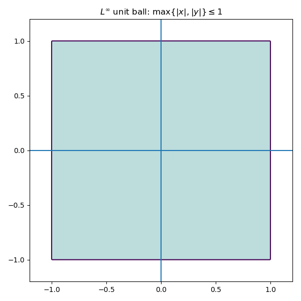

Problems involving the$1$`L^{\infty}`$ norm are often formulated as linear programs, and are useful when worst-case guarantees are more important than optimizing average performance. 

### Matrix norms

There are also various norms on matrices, each highlighting a different aspect of the associated linear transformation.
- **Frobenius norm**. This is an important norm, essentially the analogue of the$1$`L^2`$ norm for matrices. It is the Euclidean norm if you think of your matrix as a vector, forgetting its rectangular shape. For$1$`A = (a_{ij})`$ a matrix, the Frobenius norm 
```math
\|A\|_F = \sqrt{\sum a_{ij}^2}
```
  is the square root of the sum of squares of all the entries. This treats a matrix as a long vector and is invariant under orthogonal transformations. As we'll see, it plays a central role in:
  - least-squares problems,
  - low-rank approximation,
  - principal component analysis.

  In particular, the truncated SVD yields a best low-rank approximation of a matrix with respect to the Frobenius norm.

  We also that that the Frobenius norm can be written in terms of tracial data. We have that
```math
\|A\|_F^2 = \text{Tr}(A^TA) = \text{Tr}(AA^T).
```
- **Operator norm** (spectral norm). This is just the norm as an operator$1$`A: \mathbb{R}^p \to \mathbb{R}^n`$, where$1$`\mathbb{R}^p`$ and$1$`\mathbb{R}^n`$ are thought of as Hilbert spaces:
```math
\|A\| = \max_{\|x\|_2 = 1}\|Ax\|_2.
```
  This norm measures how big of an amplification $A$ can apply, and is equal to the largest singular value of $A$. This norm is related to stability properties, and is the analogue of the$1$`L^{\infty}`$ norm.
- **Nuclear norm**. The nuclear norm, defined as
```math
\|A\|_* = \sum \sigma_i,
```
  is the sum of the singular values. When $A$ is square, this is precisely the trace-class norm, and is the analogue of the$1$`L^1`$ norm. This norm acts as a generalization of the concept of rank. 

## A note on regularization

Regularization introduces additional constraints or penalties to stabilize ill-posed problems. From the linear algebra point of view, regularization modifies the singular value structure of a problem. 
- **Ridge regression**: add a positive multiple$1$`\lambda\cdot I`$ of the identity to$1$`X^TX`$ which will artificially inflate small singular values.
- This dampens unstable directions while leaving well-conditioned directions largely unaffected.
 
Geometrically, regularization reshapes the solution space to suppress directions that are poorly supported by the data.
## A note on solving multiple targets concurrently

Suppose now that we were interested in solving several problems concurrently; that is, given some data points, we would like to make $k$ predictions. Say we have our$1$`n \times p`$ data matrix $X$, and we want to make $k$ predictions$1$`y_1,\dots,y_k`$. We can then set the problem up as finding a best solution to the matrix equation
```math
XB = Y
```
where $B$ will be a$1$`p \times k`$ matrix of parameters and $Y$ will be the$1$`p \times k`$ matrix whose columns are$1$`y_1,\dots,y_k`$. 

## Polynomial Regression

Sometimes fitting a line to a set of $n$ data points clearly isn't the right thing to do. To emphasize the limitations of linear models, we generate data from a purely quadratic relationship. In this setting, the space of linear functions is not rich enough to capture the underlying structure, and the linear least-squares solution exhibits systematic error. Expanding the feature space to include quadratic terms resolves this issue.

For example, suppose our data looked like the following. 

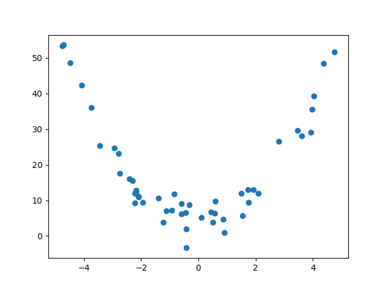

If we try to find a line of best fit, we get something that doesn't really describe or approximate our data at all...

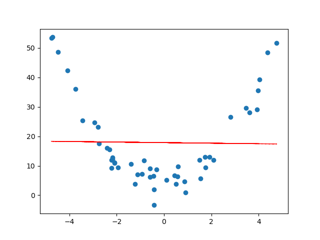

This is an example of **underfitting** data, and we can do better. The same linear regression ideas work for fitting a degree $d$ polynomial model to a set of $n$ data points. Before, when trying to fit a line to points$1$`(x_1,y_1),\dots,(x_n,y_n)`$, we had the following matrices
```math
\tilde{X} = \begin{bmatrix} 1 & x_1 \\ \vdots & \vdots \\ 1 & x_n \end{bmatrix}, y =  \begin{bmatrix} y_1 \\ \vdots \\ y_n \end{bmatrix}, \tilde{\beta} = \begin{bmatrix} \beta_0 \\ \beta_1 \end{bmatrix}
```
in the matrix equation
```math
\tilde{X}\tilde{\beta} = y,
```
and we were trying to find a vector$1$`\tilde{\beta}`$ which gave a best possible solution. This would give us a line$1$`y = \beta_0 + \beta_1x`$ which best approximates the data. To fit a polynomial$1$`y = \beta_0 + \beta_1x + \beta_2x^2 + \cdots + \beta_d^dx^d`$ to the data, we have a similar set up.

> **Definition**. The **Vandermonde matrix** is the$1$`n \times (d+1)`$ matrix
```math
V = \begin{bmatrix} 1 & x_1 & x_1^2 & \cdots & x_1^d \\ 1 & x_2 & x_2^2 & \cdots & x_2^d \\ \vdots & \vdots & \ddots & \vdots \\ 1 & x_n & x_n^2 & \cdots & x_n^d \end{bmatrix}.
```

With the Vandermonde matrix, to find a polynomial function of best fit, one just needs to find a least-squares solution to the matrix equation
```math
V\tilde{\beta} = y.
```

With the generated data above, we get the following curve. 

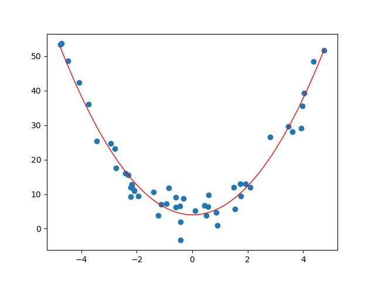

Solving these problems can be done with python. One can use `numpy.polyfit` and `numpy.poly1d`. 

> **Example**. Consider the following data.
> |House | Square ft | Bedrooms | Price (in $1000s) |
> | --- | --- | --- | --- |
> | 0 | 1600 | 3 | 500 |
> | 1 | 2100 | 4 | 650 |
> | 2 | 1550 | 2 | 475 |
> | 3 | 1600 | 3 | 490 |
> | 4 | 2000 | 4 | 620 |
>
> Suppose we wanted to predict the price of a house based on the square footage and we thought the relationship was cubic (it clearly isn't, but hey, for the sake of argument). So really we are looking at the subset of data
> |House | Square ft | Price (in $1000s) |
> | --- | --- | --- |
> | 0 | 1600 | 500 |
> | 1 | 2100 | 650 |
> | 2 | 1550 | 475 |
> | 3 | 1600 | 490 |
> | 4 | 2000 | 620 |
>
> Our Vandermonde matrix will be
```math
V = \begin{bmatrix} 1 & 1600 & 1600^2 & 1600^3 \\ 1 & 2100 & 2100^2 & 2100^3 \\ 1 & 1550 & 1550^2 & 1550^3 \\ 1 & 1600 & 1600^2 & 1600^3 \\ 1 & 2000 & 2000^2 & 2000^3 \end{bmatrix}
```
> and our target vector will be
```math
y = \begin{bmatrix} 500 \\ 650 \\ 475 \\ 490 \\ 620 \end{bmatrix}.
```
> As we can see, the entries of the Vandermonde matrix get very very large very fast. One can, if they are so inclined, compute a least-squares solution to$1$`V\tilde{\beta} = y`$ by hand. Let's not, but let us find, using python, a "best" cubic approximation of the relationship between the square footage and price.

We will use `numpy.polyfit`, `numpy.pold1d` and `numpy.linspace`.
```python
import numpy as np
import pandas as pd
import matplotlib as plt

# First let us make a dictionary incorporating our data.
# Each entry corresponds to a column (feature of our data)
data = {
    'Square ft': [1600, 2100, 1550, 1600, 2000],
    'Bedrooms': [3, 4, 2, 3, 4],
    'Price': [500, 650, 475, 490, 620]
}

# Create a pandas DataFrame
df = pd.DataFrame(data)

# Extract x (square footage) and y (price)
x = df["Square ft"].to_numpy(dtype=float)
y = df["Price"].to_numpy(dtype=float)

# Degree of polynomial
degree = 3 # cubic

# Polyfit directly on x
cubic = np.poly1d(np.polyfit(x,y, degree))

# Add fitted polynomial line and scatter plot
polyline = np.linspace(x.min(),x.max())
plt.scatter(x,y, label="Observed data")
plt.plot(polyline, cubic(polyline), 'r', label="Cubic best fit")
plt.xlabel("Square ft")
plt.ylabel("Price (in $1000s)")
plt.title("Cubic polynomial regression: Price vs Square Footage")
plt.show()
```

So we get a cubic of best fit.

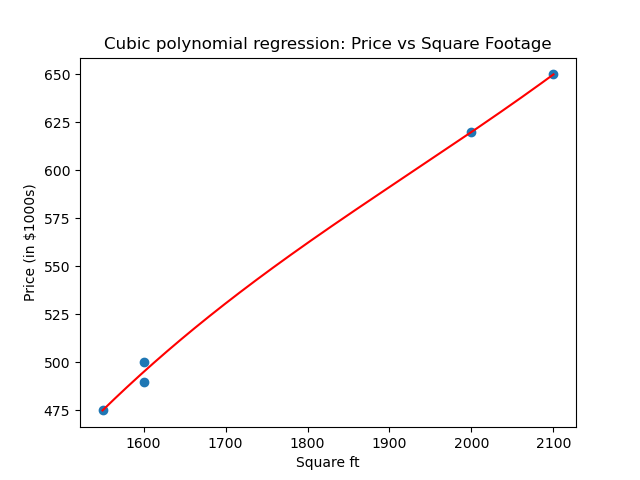

Here `numpy.polyfit` computes the least-squares solution in the polynomial basis$1$`1, x, x^2, x^3`$, i.e., it solves the Vandermonde least-squares problem. So what is our cubic polynomial?

```python
>>> cubic
poly1d([ 3.08080808e-07, -1.78106061e-03,  3.71744949e+00, -2.15530303e+03])
```
The first term is the degree 3 term, the second the degree 2 term, the third the degree 1 term, and the fourth is the constant term. 

## What can go wrong?

We are often dealing with imperfect data, so there is plenty that could go wrong. Here are some basic cases of where things can break down.

- **Perfect multicolinearity**: non-invertible$1$`\tilde{X}^T\tilde{X}`$. This happens when one feature is a perfect combination of the others. This means that the columns of the matrix$1$`\tilde{X}`$ are linearly dependent, and so infinitely many solutions will exist to the least-squares problem. 
    - For example, if you are looking at characteristics of people and you have height in both inches and centimeters.
- **Almost multicolinearity**: this happens when one features is **almost** a perfect combination of the others. From the linear algebra perspective, the columns of$1$`\tilde{X}`$ might not be dependent, but they will be be **almost** linearly dependent. This will cause problems in calculation, as the condition number will become large and amplify numerical errors. The inverse will blow up small spectral components. 
- **More features than observations**: this means that our matrix$1$`\tilde{X}`$ will be wider than it is high. Necessarily, this means that the columns are linearly dependent. Regularization or dimensionality reduction becomes essential.
- **Redundant or constant features**: this is when there is a characteristic that is satisfied by each observation. In terms of the linear algebraic data, this means that one of the columns of $X$ is constant.
    - e.g., if you are looking at characteristics of penguins, and you have "# of legs". This will always be two, and doesn't add anything to the analysis.
- **Underfitting**: the model lacks sufficient expressivity to capture the underlying structure. For example, see the section on polynomial regression -- sometimes one might want a curve vs. a straight line.


- **Overfitting**: the model captures noise rather than structure. Often due to model complexity relative to data size. Polynomial regression can give a nice visualization of overfitting. For example, if we worked with the same generated quadratic data from the polynomial regression section, and we tried to approximation it by a degree 11 polynomial, we get the following.

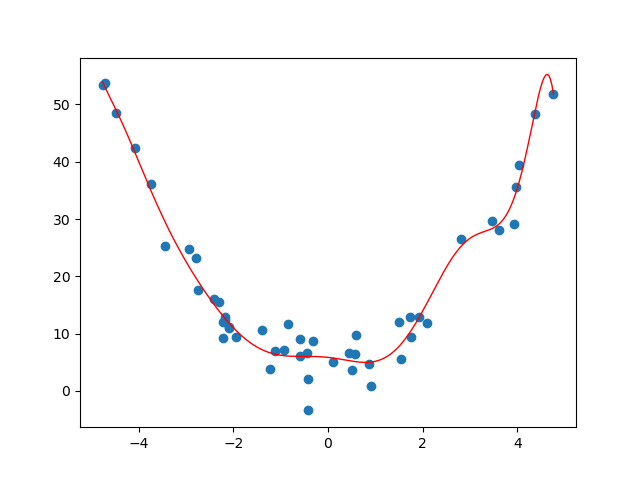
- **Outliers**: large deviations can dominate the$1$`L^2`$ norm. This is where normalization might be key.
- **Heteroscedasticity**: this is when the variance of noise changes across observations. Certain least-squares assumptions will break down.
- **Condition number**: a large condition number indicates numerical instability and sensitivity to perturbation, even when formal solutions exist.
- **Insufficient tolerance**: in numerical algorithms, thresholds used to determine rank or invertibility must be chosen carefully. Poor choices can lead to misleading results.

The point is that many failures in data science are not conceptual, but they happen geometrically and numerically. Poor choices lead to poor results. 

# Principal Component Analysis

Principal Component Analysis (PCA) addresses the issues of multicollinearity and dimensionality mentioned at the end of the previous section by transforming the data into a new coordinate system. The new axes -- called principal components -- are chosen to capture the maximum variance in the data. In linear algebra terms, we are finding a subspace of potentially smaller dimension that best approximates our data.

> **Example**: Let us return to our house example. Suppose we decide to list the square footage in both square feet and square meters. Let's add this feature to our dataset.
> |House | Square ft | Square m |  Bedrooms | Price (in $1000s) |
> | --- | --- | --- | --- | --- |
> | 0 | 1600 | 148 | 3 | 500 |
> | 1 | 2100 | 195 | 4 | 650 |
> | 2 | 1550 | 144 | 2 | 475 |
> | 3 | 1600 | 148 | 3 | 490 |
> | 4 | 2000 | 185 | 4 | 620 |
> 
> In this case, our associated matrix is:
```math
X = \begin{bmatrix} 1600 & 148 & 3 & 500 \\ 2100 & 195 & 4 & 650 \\ 1550 & 144 & 2 & 475 \\ 1600 & 148 & 3 & 490 \\ 2000 & 185  & 4 & 620 \end{bmatrix}
```

There are a few problems with the above data and the associated matrix $X$ (this time, we're not looking to make predictions, so we don't omit the last column).
- **Redundancy**: Square feet and square meters give the same information. It's just a matter of if you're from a civilized country or from an uncivilized country.
- **Numerical instability**: The columns of $X$ are nearly linearly dependent. Indeed, the second column is almost a multiple of the first. Moreover, one can make a safe bet that the number of bedrooms increases as the square footage does, so that the first and third columns are correlated.
- **Interpretation difficulty**: We used the square footage and bedrooms *together* in the previous section to predict the price of a house. However, because of their correlation, this obfuscates the true relationship, say, between the square footage and the price of a house, or the number of bedrooms and the price of a house. 

So the question becomes: what do we do about this? We will try to get a smaller matrix (less columns) that contains the same, or a close enough, amount of information. The point is that the data is *effectively* lower-dimensional. 

Let's do a little analysis on our dataset before progressing. Let's use `pandas.DataFrame.describe`, `pandas.DataFrame.corr` and `numpy.linalg.cond`. First, let's set up our data.

```python
import numpy as np
import pandas as pd

# First let us make a dictionary incorporating our data.
# Each entry corresponds to a column (feature of our data)
data = {
    'Square ft': [1600, 2100, 1550, 1600, 2000],
	'Square m': [148, 195, 144, 148, 185],
    'Bedrooms': [3, 4, 2, 3, 4],
    'Price': [500, 650, 475, 490, 620]
}

# Create a pandas DataFrame
df = pd.DataFrame(data)

# Create out matrix X
X = df.to_numpy()
```

Now let's see what it has to offer. 

```python
# Describe the data
>>> df.describe()
         Square ft    Square m  Bedrooms       Price
count     5.000000    5.000000   5.00000    5.000000
mean   1770.000000  164.000000   3.20000  547.000000
std     258.843582   24.052027   0.83666   81.516869
min    1550.000000  144.000000   2.00000  475.000000
25%    1600.000000  148.000000   3.00000  490.000000
50%    1600.000000  148.000000   3.00000  500.000000
75%    2000.000000  185.000000   4.00000  620.000000
max    2100.000000  195.000000   4.00000  650.000000
# View correlations
>>> df.corr()
           Square ft  Square m  Bedrooms     Price
Square ft   1.000000  0.999886  0.900426  0.998810
Square m    0.999886  1.000000  0.894482  0.998395
Bedrooms    0.900426  0.894482  1.000000  0.909066
Price       0.998810  0.998395  0.909066  1.000000
# Check the condition number
>>> np.linalg.cond(X)
np.float64(8222.19067218415)

```

As we can see, everything is basically correlated, and we clearly have some redundancies. 

This section is structured as follows. 
- [Low-rank approximation via SVD](#low-rank-approximation-via-svd)
- [Centering data](#centering-data)


## Low-rank approximation via SVD

Let $A$ be an$1$`n \times p`$ matrix and let$1$`A = U\Sigma V^T`$ be a SVD. Let$1$`u_1,\dots,u_n`$ be the columns of $U$,$1$`v_1,\dots,v_p`$ be the column of $V$, and$1$`\sigma_1 \geq \cdots \sigma_r > 0`$ be the singular values, where$1$`r \leq \min\{n,p\}`$ is the rank of $A$. Then we have the **reduced singular value decomposition** (see [Pseudoinverses and using the svd](#pseudoinverses-and-using-the-svd))
```math
A = \sum_{i=1}^r \sigma_i u_iv_i^T
```
(note that$1$`u_i`$ is a$1$`n \times 1`$ matrix and$1$`v_i`$ is a$1$`p \times 1`$ matrix, so$1$`u_iv_i^T`$ is some$1$`n \times p`$ matrix).
The key idea is that if the rank of $A$ is higher, say $s$, but the latter singular values are small, then we should still have an approximation like this. Say$1$`\sigma_{r+1},\dots,\sigma_{s}`$ are tiny. Then
```math
\begin{split} A &= \sum_{i=1}^s \sigma_i u_i v_i^T \\ &= \sum_{i=1}^r \sigma_i u_iv_i^T + \sum_{i=r+1}^{s} \sigma_i u_iv_i^T \\ &\approx \sum_{i=1}^r \sigma_iu_i v_i^T \end{split}.
```
So defining$1$`A_r := \sum_{i=1}^r \sigma_i u_iv_i^T`$, we are approximating $A$ by$1$`A_r`$.

In what sense is this a good approximation though? Recall that the Frobenius norm of a matrix $A$ is defined as the sqrt root of the sum of the squares of all the entries:
```math
\|A\|_F = \sqrt{\sum_{i,j} a_{ij}^2}.
```
The Frobenius norm acts as a very nice generalization of the$1$`L^2`$ norm for vectors, and is an indispensable tool in both linear algebra and data science. The point is that this "approximation" above actually works in the Frobenius norm, and this reduced singular value decomposition in fact minimizes the error.

> **Theorem** (Eckart–Young–Mirsky). Let $A$ be an$1$`n \times p`$ matrix of rank $r$. For$1$`k \leq r`$,
```math
\min_{B \text{ such that rank}(B) \leq k} \|A - B\|_F = \|A - A_k\|_F.
```
> The (at most) rank $k$ matrix$1$`A_k`$ also realizes the minimum when optimizing for the operator norm.

> **Example**. Recall that we have the following SVD:
```math
\begin{bmatrix} 3 & 2 & 2 \\ 2 & 3 & -2 \end{bmatrix} = \begin{bmatrix} \frac{1}{\sqrt{2}} & \frac{1}{\sqrt{2}} \\ \frac{1}{\sqrt{2}} & -\frac{1}{\sqrt{2}} \end{bmatrix} \begin{bmatrix} 5 & 0 & 0 \\ 0 & 3 & 0 \end{bmatrix} \begin{bmatrix} \frac{1}{\sqrt{2}} & \frac{1}{3\sqrt{2}} & -\frac{2}{3} \\ \frac{1}{\sqrt{2}} & -\frac{1}{3\sqrt{2}} & \frac{2}{3} \\ 0 & \frac{4}{3\sqrt{2}} & \frac{1}{3} \end{bmatrix}^T.
```
> So if we want a rank-one approximation for the matrix, we'll do the reduced SVD. We have
```math
\begin{split} A_1 &= \sigma_1u_1v_1^T \\ &= 5\begin{bmatrix} \frac{1}{\sqrt{2}} \\ \frac{1}{\sqrt{2}} \end{bmatrix}\begin{bmatrix} \frac{1}{\sqrt{2}} & \frac{1}{\sqrt{2}} & 0 \end{bmatrix} \\ &= \begin{bmatrix} \frac{5}{2} & \frac{5}{2} & 0 \\ \frac{5}{2} & \frac{5}{2} & 0 \end{bmatrix} \end{split}
```
> Now let's compute the (square of the) Frobenius norm of the difference$1$`A - A_1`$. We have
```math
\begin{split} \|A - A_1\|_F^2 &= \left\| \begin{bmatrix} \frac{1}{2} & -\frac{1}{2} & 2 \\ -\frac{1}{2} & \frac{1}{2} & -2 \end{bmatrix}\right\|_F^2 \\ &= 4(\frac{1}{2})^2 + 2(2^2) = 9. \end{split}
```
> So the Frobenius distance between $A$ and$1$`A_1`$ is 3, and we know by Eckart-Young-Mirsky that this is the smallest we can get when looking at the difference between $A$ and a (at most) rank one$1$`2 \times 3`$ matrix.  As mentioned, the operator norm$1$`\|A - A_1\|`$ also minimizes the distance (in operator norm). We know this to be the largest singular value. As$1$`A - A_1`$ has SVD
```math
\begin{bmatrix} \frac{1}{2} & -\frac{1}{2} & 2 \\ -\frac{1}{2} & \frac{1}{2} & -2 \end{bmatrix} = \begin{bmatrix} -\frac{1}{\sqrt{2}} & \frac{1}{\sqrt{2}} \\ \frac{1}{\sqrt{2}} & \frac{1}{\sqrt{2}} \end{bmatrix}\begin{bmatrix} 3 & 0 & 0 \\ 0 & 0 & 0 \end{bmatrix} \begin{bmatrix} -\frac{1}{3\sqrt{2}} & -\frac{4}{\sqrt{17}} & \frac{1}{3\sqrt{34}} \\ \frac{1}{3\sqrt{2}} & 0 & \frac{1}{3}\sqrt{\frac{17}{2}} \\ -\frac{2\sqrt{2}}{3} & \frac{1}{\sqrt{17}} & \frac{2}{3}\sqrt{\frac{2}{17}} \end{bmatrix},
```
> the operator norm is also 3. 

Now let's do this in python. We'll set up our matrix as usual, take the SVD, do the truncated construction of$1$`A_1`$, and use `numpy.linalg.norm` to look at the norms. 
```python
import numpy as np

# Create our matrix A
A = np.array([[3,2,2],[2,3,-2]])

# Take the SVD
U, S, Vh = np.linalg.svd(A)

# Create our rank-1 approximation
sigma1 = S[0]
u1 = U[:, [0]]		#shape (2,2)
v1T = Vh[[0], :]		#shape (3,3)
A1 = sigma1 * (u1 @ v1T)

# Take norms and view errors
frobenius_error = np.linalg.norm(A - A1, ord="fro")	#Frobenius norm
operator_error = np.linalg.norm(A - A1, ord=2)		#operator norm
```
Let's see if we get what we expect.
```python
>>> sigma1
np.float64(4.999999999999999)
>>> u1
array([[-0.70710678],
       [-0.70710678]])
>>> v1T
array([[-7.07106781e-01, -7.07106781e-01, -6.47932334e-17]])
>>> A1
array([[2.50000000e+00, 2.50000000e+00, 2.29078674e-16],
       [2.50000000e+00, 2.50000000e+00, 2.29078674e-16]])
>>> frobenius_error
np.float64(3.0)
>>> operator_error
np.float64(3.0)
```
So this numerically confirms the EYM theorem. 

## Centering data 
In data science, we rarely apply low-rank approximation to raw values directly, because translation and units can dominate the geometry. Instead, we apply these methods to centered (and often standardized) data so that low-rank structure reflects relationships among features rather than the absolute location or measurement scale. Centering converts the problem from approximating an affine cloud to approximating a linear one, in direct analogy with including an intercept term in linear regression. Therefore, before we can analyze the variance structure, we must ensure our data is centered, i.e., that each feature has a mean of 0. We achieve this by subtracting the mean of each column from every entry in that column.
Suppose $X$ is our$1$`n \times p`$ data matrix, and let
```math
\mu = \frac{1}{n}\mathbb{1}^T X.
```
Then
```math
\hat{X} = X - \mu \mathbb{1}
```
will be centered data matrix.

> **Example**. Going back to our housing example, the means of the columns are 1770, 164, 3.2, and 547, respectively. So our centered matrix is
```math
\hat{X} = \begin{bmatrix} -170 & -16 & -0.2 & -47 \\ 330 & 31 & 0.8 & 103  \\ -220 & -20 & -1.2 & -72 \\ -170 & -16 & -0.2 & -57  \\ 230 & 21 & 0.8 & 73 \end{bmatrix}.
```

Let's do this in python.

```python
import numpy as np
import pandas as pd

# First let us make a dictionary incorporating our data.
# Each entry corresponds to a column (feature of our data)
data = {
    'Square ft': [1600, 2100, 1550, 1600, 2000],
	'Square m': [148, 195, 144, 148, 185],
    'Bedrooms': [3, 4, 2, 3, 4],
    'Price': [500, 650, 475, 490, 620]
}

# Create a pandas DataFrame
df = pd.DataFrame(data)

# Create out matrix X
X = df.to_numpy()

# Get our vector of means
X_means = np.mean(X, axis=0)

# Create our centered matrix
X_centered = X - X_means

# Get the SVD for X_centered
U, S, Vh = np.linalg.svd(X_centered)
```
This returns the following.
```python
>>> X_means
array([1770. ,  164. ,    3.2,  547. ])
>>> X_centered
array([[-1.70e+02, -1.60e+01, -2.00e-01, -4.70e+01],
       [ 3.30e+02,  3.10e+01,  8.00e-01,  1.03e+02],
       [-2.20e+02, -2.00e+01, -1.20e+00, -7.20e+01],
       [-1.70e+02, -1.60e+01, -2.00e-01, -5.70e+01],
       [ 2.30e+02,  2.10e+01,  8.00e-01,  7.30e+01]])

```

We will apply the low-rank approximations from the previous sections. First let's see what our SVD looks like, and what the condition number is.
```python
>>> U
array([[-0.32486018, -0.81524197, -0.01735449, -0.17188722,  0.4472136 ],
       [ 0.63705869,  0.10707263, -0.3450375 , -0.51345964,  0.4472136 ],
       [-0.42643013,  0.35553416, -0.61058318,  0.34487822,  0.4472136 ],
       [-0.33034709,  0.436448  ,  0.61781883, -0.3445052 ,  0.4472136 ],
       [ 0.44457871, -0.08381281,  0.35515633,  0.68497384,  0.4472136 ]])
>>> S
array([5.44828440e+02, 7.61035608e+00, 8.91429037e-01, 2.41987799e-01])
>>> Vh.T
array([[ 0.95017495,  0.29361033,  0.08182661,  0.06530651],
       [ 0.08827897,  0.06690917, -0.71081981, -0.69459714],
       [ 0.00276797, -0.04366082,  0.69629997, -0.71641638],
       [ 0.29894268, -0.95258064, -0.05662119,  0.00417714]])
>>> np.linalg.cond(X_centered)
np.float64(2251.4707027583063)
```
Now let's approximate our centered matrix$1$`\hat{X}`$ by some lower-rank matrices. First, we'll define a function which will give us a rank $k$ truncated SVD. 
```python
# Defining the truncated svd
def reduced_svd_matrix_k(U, S, Vh, k):
	Uk = U[:, :k]
	Sk = np.diag(S[:k])
	Vhk = Vh[:k, :]
	return Uk @ Sk @ Vhk
```
Now, as$1$`\hat{X}`$ has rank 4, we can do a reduced matrix of rank 1,2,3. We will do this in a loop.

> **Remark**. We'll divide the error by the (Frobenius) norm so that we have a relative error. E.g., if two houses are within 10k of each other, they are similarly priced. The magnitude of error being large doesn't say much if our quantities are large.
> 
```python
for k in [1, 2, 3]:
	# Define our reduced matrix
    Xck = reduced_svd_matrix_k(U, S, Vh, k)
	# Compute the relative error
    rel_err = np.linalg.norm(X_centered - Xck, ord="fro") / np.linalg.norm(X_centered, ord="fro")
	# Print the information
    print(Xck, "\n", f"k={k}: relative Frobenius reconstruction error on centered data = {rel_err:.4f}", "\n")
```
And let's see what we get. 
```python
[[-168.1743765   -15.62476472   -0.48991109  -52.91078079]
 [ 329.79403078   30.64054254    0.96072753  103.7593243 ]
 [-220.7553464   -20.50996365   -0.64308544  -69.45373002]
 [-171.01485494  -15.88866823   -0.49818573  -53.80444804]
 [ 230.15054706   21.38285405    0.67045472   72.40963456]] 
 k=1: relative Frobenius reconstruction error on centered data = 0.0141 

[[-1.69996018e+02 -1.60398881e+01 -2.19027093e-01 -4.70007022e+01]
 [ 3.30033282e+02  3.06950642e+01  9.25150039e-01  1.02983104e+02]
 [-2.19960913e+02 -2.03289247e+01 -7.61220318e-01 -7.20311670e+01]
 [-1.70039621e+02 -1.56664278e+01 -6.43206200e-01 -5.69684681e+01]
 [ 2.29963269e+02  2.13401763e+01  6.98303572e-01  7.30172337e+01]] 
 k=2: relative Frobenius reconstruction error on centered data = 0.0017 

[[-1.69997284e+02 -1.60288915e+01 -2.29799059e-01 -4.69998263e+01]
 [ 3.30008114e+02  3.09136956e+01  7.10984571e-01  1.03000519e+02]
 [-2.20005450e+02 -1.99420315e+01 -1.14021052e+00 -7.20003486e+01]
 [-1.69994556e+02 -1.60579058e+01 -2.59724807e-01 -5.69996518e+01]
 [ 2.29989175e+02  2.11151332e+01  9.18749820e-01  7.29993076e+01]] 
 k=3: relative Frobenius reconstruction error on centered data = 0.0004 
```

This seems to check out -- it says that one rank (or one feature) should be roughly enough to describe this data. This should make sense because clearly the square meterage, # of bedrooms, and price depend on the square footage. 

# Project: Spectral Image Denoising via Truncated SVD

In this project, we will use Truncated Singular Value Decomposition (SVD) to denoise a grayscale image.
The idea is based on the Eckart-Young-Mirsky theorem: the best low-rank approximation of a matrix (in Frobenius norm) is given by truncating its SVD.

**Outline**.
1. Convert an image of my sweet, sweet dog, Bella to a grayscale image.
2. Load the grayscale image.
3. Add synthetic Gaussian noise to the image.
4. Treat the image as a matrix and compute its SVD.
5. Truncate the SVD to keep only the top $k$ singular values.
6. Reconstruct the image from the truncated SVD.
7. Compare the original, noisy, and denoised images visually and quantitatively. 

### The Setup: Images as Matrices

Suppose we have a digital image of my dog, Bella. For simplicity, let's assume it is a grayscale image. From the perspective of a computer, this image is simply a large$1$`n \times p`$ matrix $A$, where $n$ is the height in pixels and $p$ is the width. The entry$1$`A_{ij}`$ represents the brightness (intensity) of the pixel at row $i$ and column $j$, typically taking values between 0 (black) and 255 (white) (or 0 and 1 if we normalize). This matrix representation allows us to leverage linear algebra techniques for image manipulation and analysis.

> **Remark**. Color images, by contrast, consist of multiple channels (e.g., RGB), and are therefore naturally represented as collections of matrices. To avoid introducing additional structure unrelated to the core linear algebraic ideas, we will restrict ourselves to grayscale images. That is, we will convert a chosen image into grayscale and apply the SVD directly.

### Experimental Setup

We will perform the following steps.
1. **Load an preprocess the image**. Convert the image to grayscale to simplify the analysis.
2. **Add artificial Gaussian noise**. Introduce synthetic Gaussian noise to simulate real-world noise.
3. **Compute the SVD**. Decompose the noisy matrix into its singular values and vectors.
4. **Truncating the SVD**. Retain only the top $k$ singular values to create a low-rank approximation.
5. **Reconstructing the Image**. Use the truncated SVD to reconstruct the denoised image.
6. **Comparing results**. Visually and quantitatively compare the original, noisy, and denoised images. 

### Loading and Preprocessing the Image
Let's start with this picture of my beautiful dog Bella. Here it is!


Let's first convert it to grayscale.

```python
import numpy as np
import matplotlib.pyplot as plt
from PIL import Image

# Load image and convert to grayscale
img = Image.open("bella.jpg").convert("L")
A = np.array(img, dtype=float)

plt.imshow(A, cmap="gray")
plt.title("Original Grayscale Image")
plt.axis("off")
plt.show()
```

Here is the result.

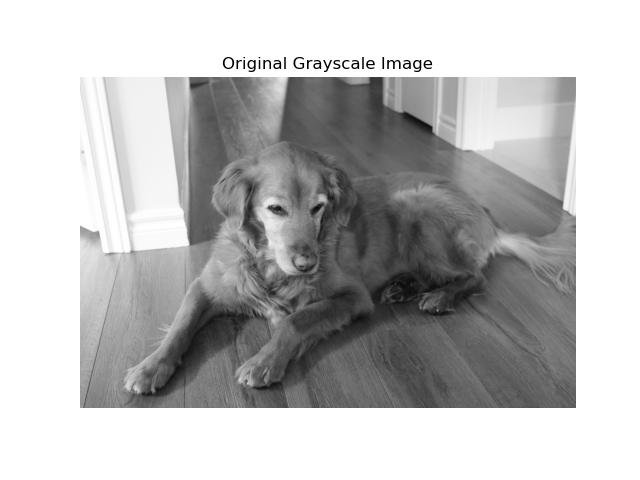

### Adding Noise

Noise is added to the image to simulate real-world conditions. The noise level can be adjusted to see how the denoising algorithm performs under the difference noise conditions. The noisy image matrix $1$`A_{\text{noisy}}`$ is created by adding Gaussian noise to the original matrix $A$. 

```python
rng = np.random.default_rng(0)

noise_level = 25
A_noisy = A + noise_level * rng.standard_normal(A.shape)

plt.imshow(A_noisy, cmap="gray")
plt.title("Noisy Image")
plt.axis("off")
```

This gives the following image. 

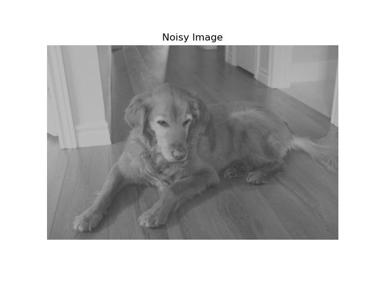


### SVD

Recall that the SVD of $A$ is given by$1$`A = U\Sigma V^T`$ where $U$ is an$1$`n \times n`$ orthogonal matrix, $V$ is a$1$`p \times p`$ orthogonal matrix, and$1$`\Sigma`$ is an$1$`n \times p`$ diagonal matrix with the singular values on the diagonal, in decreasing order. The left singular vectors correspond to the principal components of the image columns, while the right singular vectors correspond to the principal components of the image rows. 

The truncated SVD is given by$1$`A_k = U_k\Sigma_kV_k^T`$, where$1$`U_k,V_k, \Sigma_k`$ are the truncated versions of$1$`U,V, \Sigma`$, respectively. This truncated SVD gives a *best approximation* of our matrix by a lower rank matrix, in terms of the Frobenius norm. Truncating the SVD is equivalent to projecting the image onto the top $k$ principal components. 

The larger singular values correspond to the most important features of the image, while the smaller singular values often contain noise. By truncating the smaller singular values, we can remove the noise while preserving the essential information.

```python
# Take the SVD
U, S, Vh = np.linalg.svd(A_noisy)

# Define the truncated SVD
def truncated_svd(U, S, Vh, k):
    return U[:, :k] @ np.diag(S[:k]) @ Vh[:k, :]
```

If you run the code, you'll see that it takes a bit. This is because computing the SVD of a large image is computationally expensive. There are other methods (e.g., randomized SVD) that exist for scalability. 

#### Singular Value Decay

As mentioned, the singular values of an image typically decay rapidly, with the largest singular values capturing most of the important information. The smaller singular values often contain components with noise. We plot the singular values on a log scale, we can determine an appropriate truncation point $k$.

```python
plt.semilogy(S)
plt.title("Singular Value Decay")
plt.xlabel("Index")
plt.ylabel("Singular value (log scale)")
plt.show()
```


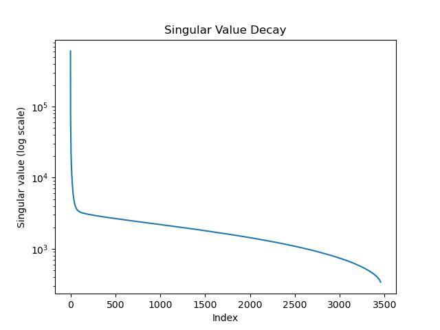

### Reconstructing the image

We reconstruct our image precisely from the truncated SVD$1$`A_k = U_k\Sigma_k V_k^T`$. 
```python
import math

# Choose values of $k$
ks = [5, 20, 50, 100]

n_images = len(ks)          # total number of reconstructions
n_cols = 2                  # number of columns in the grid
n_rows = math.ceil(n_images / n_cols)

# Create the grid of subplots
fig, axes = plt.subplots(
    n_rows,
    n_cols,
    figsize=(4 * n_cols, 4 * n_rows)
)

# axes is a 2D grid; flatten it so we can iterate over it with a for loop
axes = axes.ravel()

# Generate and display reconstructed image for each k
for ax, k in zip(axes, ks):
    # Reconstruct the rank-k approximation
    A_k = truncated_svd(U, S, Vh, k)

    # Display the image
    ax.imshow(A_k, cmap="gray")

    # Label each subplot with the truncation rank
    ax.set_title(f"k = {k}")

    # Remove axis ticks for a cleaner visualization
    ax.axis("off")

# Hide the extras
for ax in axes[n_images:]:
    ax.axis("off")

# adjust space to not overlap
plt.tight_layout()

# show the plot
plt.show()


for ax, k in zip(axes, ks):
    # Reconstruct the rank-k approximation
    A_k = truncated_svd(U, S, Vh, k)

    # Display the image
    ax.imshow(A_k, cmap="gray")

    # Label each subplot with the truncation rank
    ax.set_title(f"k = {k}")

    # Remove axis ticks for a cleaner visualization
    ax.axis("off")


fig, axes = plt.subplots(1, len(ks), figsize=(15,4))

# Generate an image for each value of $k$
for ax, k in zip(axes, ks):
    A_k = truncated_svd(U, S, Vh, k)
    ax.imshow(A_k, cmap="gray")
    ax.set_title(f"k = {k}")
    ax.axis("off")

plt.show()
```

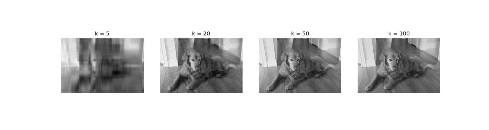

We can see that as $k$ increases, more image detail is recovered, but noise also begins to reappear.

### Quantitative Evaluation
We can quantify the quality of the denoised image using the **mean squared error (MSE)** and **peak signal-to-noise ratio (PSNR)**:
```math
\text{MSE} = \frac{1}{np} \sum_{i,j} (A_{ij} - A_k^{ij})^2, \quad \text{PSNR} = 10 \log_{10} \left( \frac{255^2}{\text{MSE}} \right)
```
MSE quantifies the difference between two images, while higher PSNR values indicate better image quality and less distortion.

Let's compute the MSE and PSNR for$1$`k=5,20,50,100`$. 

```python
def mse(A, B):
    return np.mean((A - B) ** 2)

def psnr(A, B, max_val=255.0):
    error = mse(A, B)
    if error == 0:
        return np.inf
    return 10 * np.log10((max_val ** 2) / error)

results = []

for k in ks:
    A_k = truncated_svd(U, S, Vh, k)
    mse_val = mse(A, A_k)
    psnr_val = psnr(A, A_k)
    results.append((k, mse_val, psnr_val))

# Display results
for k, m, p in results:
    print(f"k = {k:3d} | MSE = {m:10.2f} | PSNR = {p:6.2f} dB")

```

We get
```python
k =   5 | MSE =     275.48 | PSNR =  23.73 dB
k =  20 | MSE =      91.05 | PSNR =  28.54 dB
k =  50 | MSE =      56.81 | PSNR =  30.59 dB
k = 100 | MSE =      64.08 | PSNR =  30.06 dB

```

Let's put this into a table. 
| $k$  | MSE    | PSNR (dB)| Visual Quality|
|------|--------|----------|---------------|
| 5    | 275.48 | 23.73    | Very blurry   |
| 20   | 91.05  | 28.54    | Some detail   |
| 50   | 56.81  | 30.59    | Good balance  |
| 100  | 64.08  | 30.06    | Noise returns |

We can even see further values of MSE and PSNR. Although truncated SVD minimizes the reconstruction error relative to the noisy image, our quantitative evaluation measures error relative to the original clean image. As $k$ increases, the approximation increasingly fits noise-dominated singular components. Consequently, the mean squared error initially decreases as signal structure is recovered, but eventually increases once noise begins to dominate. This behavior reflects the bias–variance trade off inherent in spectral denoising and explains why the MSE is not monotone in $k$.

| $k$   | MSE    | PSNR (dB)|       Visual Quality       |
|-------|--------|----------|----------------------------|
| 200   | 107.84 | 27.80    | more noise   			     |
| 500   | 229.03 | 24.54    | even more noise			 |
| 1000  | 380.20 | 22.33    | even more noise			 |
| 3000  | 616.74 | 20.23    | recovering our noisy image |

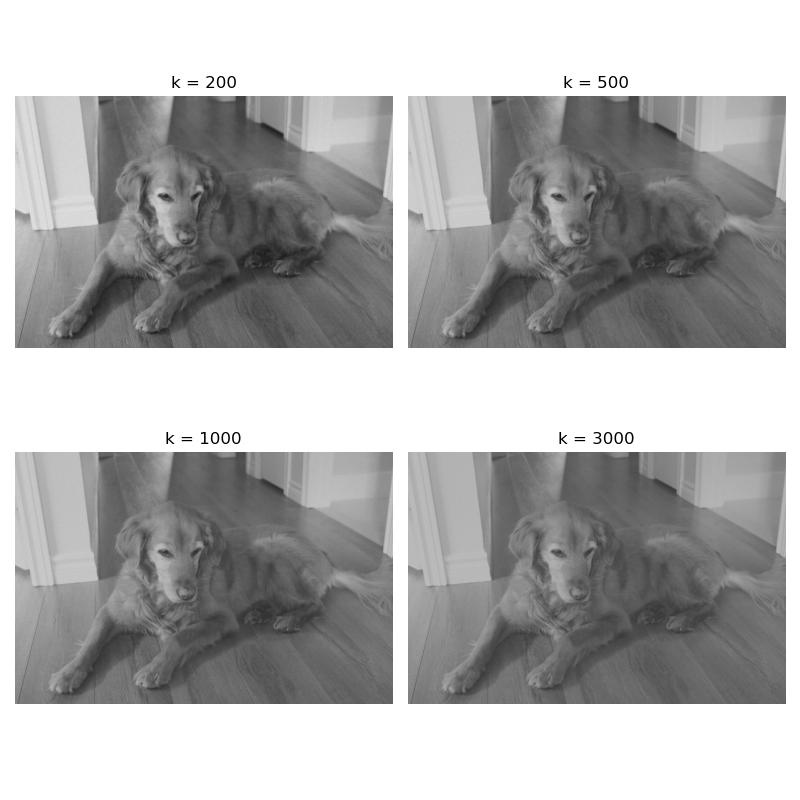

Note that the MSE between the original matrix A and the noisy matrix is 624.67. 
```python
>>> mse(A,A_noisy)
np.float64(624.6700890361011)
```
So as the $k$ goes to the maximum it can be (in this case, 3456, as the image is 5184 x 3456), we should expect the MSE to go towards this value -- i.e., as $k$ gets higher, we are just approximating our noisy image better and better. 
# Appendix

## Figures

### Line of best fit
#### Line of best fit for generated scatter plot	
The first figure is a line of best fit for scattered points. Here is the python code that will produce the image. 

```python
import numpy as np
import matplotlib.pyplot as plt

# 1. Generate some synthetic data
# We set a random seed for reproducibility
np.random.seed(3)

# Create 50 random x values between 0 and 10
x = np.random.uniform(0, 10, 50)

# Create y values with a linear relationship plus some random noise
# True relationship: y = 2.5x + 5 + noise
noise = np.random.normal(0, 2, 50)
y = 2.5 * x + 5 + noise

# 2. Calculate the line of best fit
# np.polyfit(x, y, deg) returns the coefficients for the polynomial
# deg=1 specifies a linear fit (first degree polynomial)
slope, intercept = np.polyfit(x, y, 1)

# Create a polynomial function from the coefficients
# This allows us to pass x values directly to get predicted y values
fit_function = np.poly1d((slope, intercept))

# Generate x values for plotting the line (smoothly across the range)
x_line = np.linspace(x.min(), x.max(), 100)
y_line = fit_function(x_line)

# 3. Plot the data and the line of best fit
plt.figure(figsize=(10, 6))

# Plot the scatter points
plt.scatter(x, y, color='purple', label='Data Points', alpha=0.7)

# Plot the line of best fit
plt.plot(x_line, y_line, color='steelblue', linestyle='--', linewidth=2, label='Line of Best Fit')

# Add labels and title
plt.xlabel('X Axis')
plt.ylabel('Y Axis')
plt.title('Scatter Plot with Line of Best Fit')

# Add the equation to the plot
# The f-string formats the slope and intercept to 2 decimal places
plt.text(1, 25, f'y = {slope:.2f}x + {intercept:.2f}', fontsize=12, bbox=dict(facecolor='white', alpha=0.8))

# Display legend and grid
plt.legend()
plt.grid(True, linestyle=':', alpha=0.6)

# Show the plot
plt.show()
```

Alternatively, we can do the following using `matplotlib.pyplot.axline`.

```python
import numpy as np
import matplotlib.pyplot as plt

# Generate data (same as above)
np.random.seed(3)
x = np.random.uniform(0, 10, 50)
y = 2.5 * x + 5 + np.random.normal(0, 2, 50)

# Calculate slope and intercept
slope, intercept = np.polyfit(x, y, 1)

plt.figure(figsize=(10, 6))
plt.scatter(x, y, color='purple', label='Data Points', alpha=0.7)

# Plot the line using axline
# xy1=(0, intercept) is the y-intercept point
# slope=slope defines the steepness
plt.axline(xy1=(0, intercept), slope=slope, color='steelblue', linestyle='--', linewidth=2, label='Line of Best Fit')

# Add the equation to the plot
# The f-string formats the slope and intercept to 2 decimal places
plt.text(1, 25, f'y = {slope:.2f}x + {intercept:.2f}', fontsize=12, bbox=dict(facecolor='white', alpha=0.8))


plt.xlabel('X Axis')
plt.ylabel('Y Axis')
plt.title('Scatter Plot with Line of Best Fit')
plt.legend()
plt.grid(True, linestyle=':', alpha=0.6)
plt.show()
```

See
- https://stackoverflow.com/questions/37234163/how-to-add-a-line-of-best-fit-to-scatter-plot
- https://www.statology.org/line-of-best-fit-python/
- https://stackoverflow.com/questions/6148207/linear-regression-with-matplotlib-numpy

### Projection of vector onto subspace

Here is the code to generate the image of the projection of$1$`\text{Proj}(v)`$ of a vector $v$ onto a plane in$1$`\mathbb{R}^3`$. 

```python
import numpy as np
import matplotlib.pyplot as plt

# Linear algebra helper functions
def proj_onto_subspace(A, v):
    """
    Project vector v onto Col(A) where A is (3 x k) with columns spanning the subspace.
    Uses the formula: P = A (A^T A)^(-1) A^T (for full column rank A).
    """
    AtA = A.T @ A
    return A @ np.linalg.solve(AtA, A.T @ v)

def make_plane_grid(a, b, u_range=(-1.5, 1.5), v_range=(-1.5, 1.5), n=15):
    """
    Plane through origin spanned by vectors a and b.
    Returns meshgrid points X,Y,Z for surface plotting.
    """
    uu = np.linspace(*u_range, n)
    vv = np.linspace(*v_range, n)
    U, V = np.meshgrid(uu, vv)
    P = U[..., None] * a + V[..., None] * b   # shape (n,n,3)
    return P[..., 0], P[..., 1], P[..., 2]

# Choose a plan and a vector
# Plane basis vectors (span a 2D subspace in R^3)
a = np.array([1.0, 0.2, 0.0])
b = np.array([0.2, 1.0, 0.3])
# Create the associated matrix
# 3x2 matrix of full column rank
# the column space will be a plane
A = np.column_stack([a, b]) 

# Vector to project
v = np.array([0.8, 0.6, 1.2])

# Projection and residual
p = proj_onto_subspace(A, v)
r = v - p

# Plot
fig = plt.figure(figsize=(9, 7))
# 1 row, 1 column, 1 subplot
# axis lives in R^3
ax = fig.add_subplot(111, projection="3d")

# Plane surface
X, Y, Z = make_plane_grid(a, b)
# Here is a rectangular grid of points in 3D; draw a surface through them.
ax.plot_surface(X, Y, Z, alpha=0.25)

origin = np.zeros(3)

# v, p, and residual r
ax.quiver(*origin, *v, arrow_length_ratio=0.08, linewidth=2)
ax.quiver(*origin, *p, arrow_length_ratio=0.08, linewidth=2)
ax.quiver(*p, *r, arrow_length_ratio=0.08, linewidth=2)

# Drop line from v to its projection on the plane
ax.plot([v[0], p[0]],
		[v[1], p[1]],
		[v[2], p[2]],
		linestyle="--", linewidth=2)

# Points for emphasis
ax.scatter(*v, s=60)
ax.scatter(*p, s=60)

# Labels (simple text)
ax.text(*v, "  v")
ax.text(*p, "  Proj(v)")

# Make axes look nice
ax.set_xlabel("x")
ax.set_ylabel("y")
ax.set_zlabel("z")
ax.set_title("Projection of a vector onto a plane")

# Set symmetric limits so the picture isn't squished
all_pts = np.vstack([origin, v, p])
m = np.max(np.abs(all_pts)) * 1.3 + 0.2
ax.set_xlim(-m, m)
ax.set_ylim(-m, m)
ax.set_zlim(-m, m)

# Adjust spacing so labels, titles, and axes don’t overlap or get cut off.
plt.tight_layout()

plt.show()
```

###$1$`L^1`$ and$1$`L^{\infty}`$ unit balls

To generate the matplotlib image of the$1$`L^1`$ unit ball, let's use the following code.

```python
import numpy as np
import matplotlib.pyplot as plt

# Grid
xx = np.linspace(-1.2, 1.2, 400)
yy = np.linspace(-1.2, 1.2, 400)
X, Y = np.meshgrid(xx, yy)

# Take the$1$`L^1`$ norm
Z = np.abs(X) + np.abs(Y)

plt.figure(figsize=(6,6))
plt.contour(X, Y, Z, levels=[1])
plt.contourf(X, Y, Z, levels=[0,1], alpha=0.3)

plt.axhline(0)
plt.axvline(0)
plt.gca().set_aspect("equal", adjustable="box")
plt.title(r$1$`L^1`$ unit ball:$1$`|x|+|y|\leq 1`$")
plt.tight_layout()
plt.show()
```

For the$1$`L^{\infty}`$ unit ball:

```python
import numpy as np
import matplotlib.pyplot as plt

# Grid
xx = np.linspace(-1.2, 1.2, 400)
yy = np.linspace(-1.2, 1.2, 400)
X, Y = np.meshgrid(xx, yy)

# Take the$1$`L^{\infty}`$ norm
Z = np.maximum(np.abs(X), np.abs(Y))

plt.figure(figsize=(6,6))
plt.contour(X, Y, Z, levels=[1])
plt.contourf(X, Y, Z, levels=[0,1], alpha=0.3)

plt.axhline(0)
plt.axvline(0)
plt.gca().set_aspect("equal", adjustable="box")
plt.title(r$1$`L^{\infty}`$ unit ball:$1$`\max\{|x|,|y|\} \leq 1`$")
plt.tight_layout()
plt.show()
```

### Polynomial of best fit

First  let us generate the data and show it in a simple scatter plot. 
```python
import numpy as np
import matplotlib.pyplot as plt

# 1) Generate quadratic data
np.random.seed(3)

n = 50
x = np.random.uniform(-5, 5, n)   # symmetric, wider range

# True relationship: y = ax^2 + c + noise
a_true = 2.0
c_true = 5.0
noise = np.random.normal(0, 3, n)

y = a_true * x**2 + c_true + noise
```

Now to generate the scatter plot.

```python
# add the scatter points to the plot
plt.scatter(x,y)

# plot it
plt.show()
```

As for a *line of best fit*, the following will generate the scatter plot vs. the line.

```python
# find a line of best fit
a,b = np.polyfit(x, y, 1)

# add scatter points to plot
plt.scatter(x,y)

# add line of best fit to plot
plt.plot(x, a*x + b, 'r', linewidth=1)

# plot it
plt.show()
```

Now let us do the quadratic of best fit on top of the scatter plot. 

```python
# polynomial fit with degree = 2
poly = np.polyfit(x,y,2)
model = np.poly1d(poly)

# add scatter points to plot
plt.scatter(x,y)

# add the quadratic to the plot
polyline=np.linspace(x.min(), x.max())
plt.plot(polyline, model(polyline), 'r', linewidth=1)

# plot it
plt.show()
```

# Bibliography

## Mathematics

- Gene H. Golub and Charles F. Van Loan, *Matrix Computations*. John Hopkins University Press, 2013.
- Mark H. Holmes, *Introduction to scientific computing and data analysis*. Vol. 13. Springer Nature, 2023.  
- David C. Lay, Steven R. Lay, and Judith J. McDonald, *Linear Algebra and Its Applications*, Pearson, 2021. ISBN 013588280X.
- https://ubcmath.github.io/MATH307/index.html
- https://eecs16b.org/notes/fa23/note16.pdf
- https://en.wikipedia.org/wiki/Low-rank_approximation
- https://www-labs.iro.umontreal.ca/~grabus/courses/ift6760_W20_files/lecture-5.pdf
- https://www.statology.org/polynomial-regression-python/
- https://en.wikipedia.org/wiki/Mean_squared_error
- https://en.wikipedia.org/wiki/Peak_signal-to-noise_ratio

## Python
### Numpy (https://numpy.org/doc/stable/index.html)
- numpy basics: https://numpy.org/doc/stable/user/absolute_beginners.html
- numpy.array: https://numpy.org/doc/stable/reference/generated/numpy.array.html
- numpy.hstack: https://numpy.org/doc/stable/reference/generated/numpy.hstack.html (Stack arrays in sequence horizontally (column wise).)
- numpy.column_stack: https://numpy.org/doc/stable/reference/generated/numpy.column_stack.html (Stack 1-D arrays as columns into a 2-D array.)
- numpy.shape: https://numpy.org/doc/stable/reference/generated/numpy.shape.html (Return the shape of an array.)
- numpy.polyfit: https://numpy.org/doc/stable/reference/generated/numpy.polyfit.html (Least squares polynomial fit.)
- numpy.mean: https://numpy.org/doc/stable/reference/generated/numpy.mean.html (Compute the arithmetic mean along the specified axis.)
- numyp.poly1d: https://numpy.org/doc/stable/reference/generated/numpy.poly1d.html (A one-dimensional polynomial class.)
- numpy.set_printoptions: https://numpy.org/doc/stable/reference/generated/numpy.set_printoptions.html (These options determine the way floating point numbers, arrays and other NumPy objects are displayed.)
- numpy.finfo: https://numpy.org/doc/stable/reference/generated/numpy.finfo.html (Machine limits for floating point types.)
- numpy.logspace: https://numpy.org/doc/stable/reference/generated/numpy.logspace.html (Return numbers spaced evenly on a log scale.)
- numpy.sum: https://numpy.org/doc/stable/reference/generated/numpy.sum.html (Sum of array elements over a given axis.)
- numpy.abs: https://numpy.org/doc/stable/reference/generated/numpy.absolute.html (Calculate the absolute value element-wise.)
- numpy.ndarray.T: https://numpy.org/doc/stable/reference/generated/numpy.ndarray.T.html (View of the transposed array.)
- numpy.ones: https://numpy.org/doc/stable/reference/generated/numpy.ones.html (Return a new array of given shape and type, filled with ones.)
- numpy.zeros: https://numpy.org/doc/stable/reference/generated/numpy.zeros.html (Return a new array of given shape and type, filled with zeros.)
- numpy.diag: https://numpy.org/doc/stable/reference/generated/numpy.diag.html (Extract a diagonal or construct a diagonal array.)
- numpy.cumsum: https://numpy.org/doc/stable/reference/generated/numpy.cumsum.html (Return the cumulative sum of the elements along a given axis.)
- numpy.meshgrid: https://numpy.org/doc/stable/reference/generated/numpy.meshgrid.html (Return a tuple of coordinate matrices from coordinate vectors.)
- numpy.linspace: https://numpy.org/doc/stable/reference/generated/numpy.linspace.html (Return evenly spaced numbers over a specified interval.)
- numpy.ravel: https://numpy.org/doc/stable/reference/generated/numpy.ravel.html (Return a contiguous flattened array.)
- numpy.vstack: https://numpy.org/doc/stable/reference/generated/numpy.vstack.html (Stack arrays in sequence vertically (row wise).)

#### numpy.random (https://numpy.org/doc/stable/reference/random/index.html)
- numpy.random.seed: https://numpy.org/doc/stable/reference/random/generated/numpy.random.seed.html (Reseed the singleton RandomState instance.)
- numpy.random.normal: https://numpy.org/doc/stable/reference/random/generated/numpy.random.normal.html (Draw random samples from a normal (Gaussian) distribution.)
- numpy.random.default_rng: https://numpy.org/doc/stable/reference/random/generator.html (Construct a new Generator with the default BitGenerator (PCG64).)
- numpy.random.uniform: https://numpy.org/doc/stable/reference/random/generated/numpy.random.uniform.html (Draw samples from a uniform distribution.)

#### numpy.linalg (https://numpy.org/doc/stable/reference/routines.linalg.html)
- numpy.linalg.qr: https://numpy.org/doc/stable/reference/generated/numpy.linalg.qr.html (Compute the qr factorization of a matrix.
- numpy.linalg.svd: https://numpy.org/doc/stable/reference/generated/numpy.linalg.svd.html (Singular Value Decomposition.)
- numpy.linalg.solve: https://numpy.org/doc/stable/reference/generated/numpy.linalg.solve.html (Solve a linear matrix equation, or system of linear scalar equations.)
- numpy.linalg.lstsq: https://numpy.org/doc/stable/reference/generated/numpy.linalg.lstsq.html (Return the least-squares solution to a linear matrix equation.)
- numpy.linalg.norm: https://numpy.org/doc/stable/reference/generated/numpy.linalg.norm.html (Matrix or vector norm.)
- numpy.linalg.pinv: https://numpy.org/doc/stable/reference/generated/numpy.linalg.pinv.html (Compute the (Moore-Penrose) pseudo-inverse of a matrix.)
- numpy.linalg.cond: https://numpy.org/doc/stable/reference/generated/numpy.linalg.cond.html (Compute the condition number of a matrix.)

### Matplotlib (https://matplotlib.org/stable/users/getting_started/)
- matplotlib.pyplot: https://matplotlib.org/stable/api/pyplot_summary.html
- matplotlib.figure: https://matplotlib.org/stable/api/figure_api.html (Implements the following classes: `Figure` and `SubFigure`)
- mpl_toolkits.mplot3d.axes3d.Axes3D.plot_surface: https://matplotlib.org/stable/api/_as_gen/mpl_toolkits.mplot3d.axes3d.Axes3D.plot_surface.html#mpl_toolkits.mplot3d.axes3d.Axes3D.plot_surface (Create a surface plot.)

#### matplotlib.pyplot
- matplotlib.pyplot.plot: https://matplotlib.org/stable/api/_as_gen/matplotlib.pyplot.plot.html (Plot y versus x as lines and/or markers.)
- matplotlib.pyplot.quiver: https://matplotlib.org/stable/api/_as_gen/matplotlib.pyplot.quiver.html (Plot a 2D field of arrows.)
- matplotlib.pyplot.tight_layout: https://matplotlib.org/stable/api/_as_gen/matplotlib.pyplot.tight_layout.html (Adjust the padding between and around subplots.)
- matplotlib.pyplot.legend: https://matplotlib.org/stable/api/_as_gen/matplotlib.pyplot.legend.html (Place a legend on the Axes.)
- matplotlib.pyplot.show: https://matplotlib.org/stable/api/_as_gen/matplotlib.pyplot.show.html (Display all open figures.)
- matplotlib.pyplot.xlabel: https://matplotlib.org/stable/api/_as_gen/matplotlib.pyplot.xlabel.html (Set the label for the x-axis.)
- matplotlib.pyplot.ylabel: https://matplotlib.org/stable/api/_as_gen/matplotlib.pyplot.ylabel.html (Set the label for the y-axis.)
- matplotlib.pyplot.title: https://matplotlib.org/stable/api/_as_gen/matplotlib.pyplot.title.html (Set a title for the Axes.)
- matplotlib.pyplot.scatter: https://matplotlib.org/stable/api/_as_gen/matplotlib.pyplot.scatter.html (A scatter plot of y vs. x with varying marker size and/or color.)
- matplotlib.pyplot.imshow: https://matplotlib.org/stable/api/_as_gen/matplotlib.pyplot.imshow.html (Display data as an image, i.e., on a 2D regular raster.)
- matplotlib.pyplot.axis: https://matplotlib.org/stable/api/_as_gen/matplotlib.pyplot.axis.html (Convenience method to get or set some axis properties.)
- matplotlib.pyplot.semilogy: https://matplotlib.org/stable/api/_as_gen/matplotlib.pyplot.semilogy.html (Make a plot with log scaling on the y-axis.)
- matplotlib.pyplot.subplots: https://matplotlib.org/stable/api/_as_gen/matplotlib.pyplot.subplots.html (Create a figure and a set of subplots.)
- matplotlib.pyplot.contour: https://matplotlib.org/stable/api/_as_gen/matplotlib.pyplot.contour.html (Plot contour lines.)
- matplotlib.pyplot.contourf: https://matplotlib.org/stable/api/_as_gen/matplotlib.pyplot.contourf.html (Plot filled contours.)
- matplotlib.pyplot.axhline: https://matplotlib.org/stable/api/_as_gen/matplotlib.pyplot.axhline.html (Add a horizontal line spanning the whole or fraction of the Axes.)
- matplotlib.pyplot.axvline: https://matplotlib.org/stable/api/_as_gen/matplotlib.pyplot.axvline.html (Add a vertical line spanning the whole or fraction of the Axes.)
- matplotlib.pyplot.gca: https://matplotlib.org/stable/api/_as_gen/matplotlib.pyplot.gca.html (Get the current Axes.)

#### matplotlib.figure
- matplotlib.figure.Figure.add_subplot : https://matplotlib.org/stable/api/_as_gen/matplotlib.figure.Figure.add_subplot.html (Add an `Axes` to the figure as part of a subplot arrangement.)]

#### matplotlib.axes
- matplotlib.axes.Axes.set_title: https://matplotlib.org/stable/api/_as_gen/matplotlib.axes.Axes.set_title.html (Set a title for the Axes.)
- matplotlib.axes.Axes.imshow: https://matplotlib.org/stable/api/_as_gen/matplotlib.axes.Axes.imshow.html (Display data as an image, i.e., on a 2D regular raster.)
- matplotlib.axes.Axes.axis: https://matplotlib.org/stable/api/_as_gen/matplotlib.axes.Axes.axis.html (Convenience method to get or set some axis properties.)
- matplotlib.axes.Axes.text: https://matplotlib.org/stable/api/_as_gen/matplotlib.axes.Axes.text.html (Add text to the Axes.)
- matplotlib.axes.Axes.set_xlabel: https://matplotlib.org/stable/api/_as_gen/matplotlib.axes.Axes.set_xlabel.html (Set the label for the x-axis.)
- matplotlib.axes.Axes.set_ylabel: https://matplotlib.org/stable/api/_as_gen/matplotlib.axes.Axes.set_ylabel.html (Set the label for the y-axis.)
- matplotlib.axes.Axes.set_xlim: https://matplotlib.org/stable/api/_as_gen/matplotlib.axes.Axes.set_xlim.html (Set the x-axis view limits.)
- matplotlib.axes.Axes.set_aspect: https://matplotlib.org/stable/api/_as_gen/matplotlib.axes.Axes.set_aspect.html (Set the aspect ratio of the Axes scaling, i.e. y/x-scale.)

#### Scatter plots with line of best fit
- https://stackoverflow.com/questions/37234163/how-to-add-a-line-of-best-fit-to-scatter-plot
- https://www.statology.org/line-of-best-fit-python/
- https://stackoverflow.com/questions/6148207/linear-regression-with-matplotlib-numpy

### Pandas
- pandas basics: https://pandas.pydata.org/docs/user_guide/index.html
- pandas.DataFrame: https://pandas.pydata.org/pandas-docs/stable/reference/api/pandas.DataFrame.html (Two-dimensional, size-mutable, potentially heterogeneous tabular data.)
#### pandas.DataFrame
- pandas.DataFrame.describe: https://pandas.pydata.org/pandas-docs/stable/reference/api/pandas.DataFrame.describe.html (Generate descriptive statistics.)
- pandas.DataFrame.corr: https://pandas.pydata.org/pandas-docs/stable/reference/api/pandas.DataFrame.corr.html (Compute pairwise correlation of columns, excluding NA/null values.)
- pandas.DataFrame.to_numpy: https://pandas.pydata.org/docs/reference/api/pandas.DataFrame.to_numpy.html (Convert the DataFrame to a NumPy array.)
- pandas.DataFrame.plot: https://pandas.pydata.org/pandas-docs/stable/reference/api/pandas.DataFrame.plot.html (Make plots of Series or DataFrame.)

### Pillow
- PIL basics: https://pillow.readthedocs.io/en/stable/
- PIL.Image: https://pillow.readthedocs.io/en/stable/reference/Image.html

### Math
- Math basics:  https://docs.python.org/3/library/math.html
- math.ceil: https://docs.python.org/3/library/math.html#math.ceil (Return the ceiling of x, the smallest integer greater than or equal to x)


# License

This project is licensed under the MIT License.
See the [`LICENSE`](./LICENSE) file for details.


